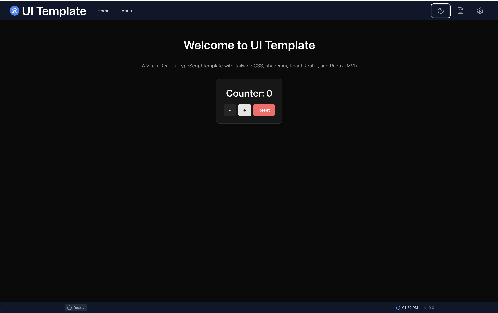

# UI Template

A production-ready React template with AWS serverless backend, authentication, and multi-environment deployment.



## Architecture Overview


## Features

- **Frontend**: React 19 + TypeScript + Vite + Tailwind CSS
- **State Management**: Redux Toolkit with typed hooks
- **UI Components**: Headless UI + Lucide icons
- **Authentication**: AWS Cognito with Amplify SDK
- **Backend**: AWS Lambda (Node.js 20) + API Gateway
- **CDN**: CloudFront distribution with S3 static hosting
- **CI/CD**: GitHub Actions with multi-environment deployment
- **Theming**: Light/Dark/System mode support
- **Logging**: Configurable console logging with categories
- **Version Tracking**: Auto-incrementing version with environment indicator in status bar

## Quick Start

### Local Development

```bash
# Install dependencies
npm install

# Start development server
npm run dev

# Or start both frontend and local API server
npm run start
```

Open [http://localhost:5173](http://localhost:5173) in your browser.

### AWS Deployment

For detailed deployment instructions, see the **[Deployment Guide](./docs/deployment-guide.md)**.

**Quick deploy to dev:**

```bash
# Configure AWS CLI
aws configure

# Deploy to development environment
npm run sam:deploy:dev
```

## Project Structure

```
ui-template/
├── src/                      # Frontend source code
│   ├── components/           # React components
│   │   ├── auth/             # Authentication components
│   │   ├── layout/           # TopBar, BottomBar, Layout
│   │   ├── settings/         # Settings modal
│   │   └── ui/               # Reusable UI components
│   ├── context/              # React contexts (ThemeProvider)
│   ├── hooks/                # Custom hooks (useAuth)
│   ├── services/             # API client, auth service
│   ├── store/                # Redux store and slices
│   └── utils/                # Utilities (Logger)
├── lambda/                   # AWS Lambda functions
│   └── api/                  # API handler
├── docs/                     # Documentation
│   ├── deployment-guide.md   # AWS deployment guide
│   ├── images/               # Generated diagrams
│   └── puml/                 # PlantUML source files
├── .github/workflows/        # CI/CD pipelines
├── template.yaml             # AWS SAM template
└── samconfig.toml            # SAM configuration
```

## Available Scripts

| Script | Description |
|--------|-------------|
| `npm run dev` | Start Vite dev server |
| `npm run build` | Build for production |
| `npm run start` | Start frontend + local API |
| `npm run server` | Start local API server only |
| `npm run lint` | Run ESLint |
| `npm run typecheck` | TypeScript type checking |
| `npm run version:patch` | Bump patch version |
| `npm run version:minor` | Bump minor version |
| `npm run version:major` | Bump major version |
| `npm run sam:build` | Build Lambda functions |
| `npm run sam:local` | Run Lambda locally |
| `npm run sam:deploy:dev` | Auto-bump version + deploy to dev |
| `npm run sam:deploy:int` | Auto-bump version + deploy to int |
| `npm run sam:deploy:prod` | Auto-bump version + deploy to prod |

## Version & Environment

The status bar displays the current environment and version:

| Environment | Badge | When |
|-------------|-------|------|
| LOCAL | Gray | Local development |
| DEV | Blue | Deployed to dev |
| INT | Amber | Deployed to int/staging |
| PROD | Red | Deployed to production |

Version is automatically bumped on each SAM deploy. See the [Deployment Guide](./docs/deployment-guide.md#version-management) for details.

## Environment Configuration

Create a `.env` file for local development:

```bash
# AWS Cognito (optional for local dev)
VITE_COGNITO_USER_POOL_ID=
VITE_COGNITO_USER_POOL_CLIENT_ID=
VITE_COGNITO_REGION=eu-central-1

# API URL
VITE_API_URL=http://localhost:3030

# Environment
VITE_ENVIRONMENT=local
```

## Deployment Environments

| Environment | Trigger | Description |
|-------------|---------|-------------|
| **dev** | Push to `develop` | Development/testing |
| **int** | Push to `main` | Integration/staging |
| **prod** | Tag `v*` | Production |

## Documentation

- **[Deployment Guide](./docs/deployment-guide.md)** - Complete AWS deployment instructions
- **[Architecture Diagram](./docs/images/aws-architecture.png)** - Detailed AWS architecture
- **[CI/CD Flow](./docs/images/cicd-flow.png)** - GitHub Actions deployment flow

## Tech Stack

### Frontend
- [React 19](https://react.dev/)
- [TypeScript](https://www.typescriptlang.org/)
- [Vite](https://vite.dev/)
- [Tailwind CSS](https://tailwindcss.com/)
- [Redux Toolkit](https://redux-toolkit.js.org/)
- [Headless UI](https://headlessui.com/)
- [AWS Amplify](https://docs.amplify.aws/)

### Backend
- [AWS Lambda](https://aws.amazon.com/lambda/)
- [Amazon API Gateway](https://aws.amazon.com/api-gateway/)
- [Amazon Cognito](https://aws.amazon.com/cognito/)
- [Amazon S3](https://aws.amazon.com/s3/)
- [Amazon CloudFront](https://aws.amazon.com/cloudfront/)
- [AWS SAM](https://aws.amazon.com/serverless/sam/)

## License

MIT
