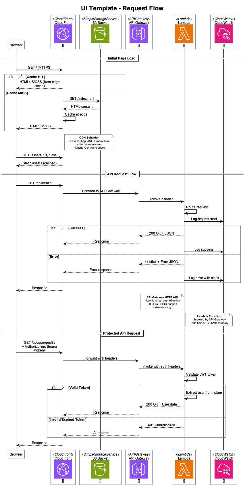

# AWS Infrastructure Documentation

This document describes the AWS infrastructure deployed by the UI Template using SST v3.

## Overview

The UI Template deploys a serverless web application stack to AWS eu-central-1 region using SST (Serverless Stack) v3 as Infrastructure as Code (IaC).


## Components

### CloudFront Distribution

| Property | Value |
|----------|-------|
| Service | Amazon CloudFront |
| Purpose | Global CDN and HTTPS termination |
| Origin | S3 bucket (static) + Lambda Function URL (API) |

**Features:**
- Global edge network for low latency
- Automatic HTTPS with AWS Certificate Manager
- SPA routing (404 errors redirect to index.html)
- Gzip/Brotli compression
- Cache-Control header support

**Behaviors:**
- Default (`/*`) → S3 origin for static assets
- API (`/api/*`) → Lambda Function URL origin

### S3 Bucket (Static Website)

| Property | Value |
|----------|-------|
| Service | Amazon S3 |
| Purpose | Static website hosting |
| Access | Private (CloudFront OAI only) |

**Contents:**
- Vite React build output (`dist/`)
- `index.html` - SPA entry point
- JavaScript bundles (code-split)
- CSS stylesheets
- Static assets (images, fonts)

### Lambda Function (API)

| Property | Value |
|----------|-------|
| Service | AWS Lambda |
| Runtime | Node.js 20.x |
| Memory | 256 MB |
| Timeout | 30 seconds |
| Handler | `lambda/api/index.handler` |

**Function URL:**
- Direct HTTPS endpoint (no API Gateway required)
- Built-in CORS support
- Lower cost than API Gateway
- Automatic TLS termination

**Environment Variables:**
| Variable | Description |
|----------|-------------|
| `NODE_ENV` | Deployment stage |
| `LOG_LEVEL` | `debug` (non-prod) / `warn` (prod) |
| `USER_POOL_ID` | Cognito User Pool ID |
| `USER_POOL_CLIENT_ID` | Cognito Client ID |
| `CORS_ORIGIN` | Allowed origins (`*`) |
| `REGION` | AWS region |

### Cognito User Pool (Authentication)

| Property | Value |
|----------|-------|
| Service | Amazon Cognito |
| Purpose | User authentication and management |
| Auth Methods | Email/password |

**Configuration:**
- **Username:** Email address
- **Password Policy:**
  - Minimum 8 characters
  - Requires lowercase, uppercase, numbers
  - Symbols optional
- **Email:** Auto-verified attribute
- **User Attributes:** email, given_name, family_name

**Token Configuration:**
| Token Type | Validity |
|------------|----------|
| Access Token | 1 hour |
| ID Token | 1 hour |
| Refresh Token | 30 days |

**Auth Flows:**
- SRP (Secure Remote Password) - primary
- User password authentication - fallback
- Refresh token authentication

### CloudWatch (Monitoring)

| Property | Value |
|----------|-------|
| Service | Amazon CloudWatch |
| Purpose | Logging and metrics |

**Log Groups:**
- Lambda function logs
- API request/response logging

**Metrics:**
- Invocation count
- Duration
- Errors
- Throttles

## Data Flow

### Request Flow

The following diagram shows how HTTP requests flow through the infrastructure:



**Static Asset Request:**
1. Browser requests `/` or static asset
2. CloudFront checks edge cache
3. On cache miss, fetches from S3
4. Response cached at edge, returned to browser

**API Request:**
1. Browser requests `/api/*`
2. CloudFront forwards to Lambda Function URL
3. Lambda processes request
4. Response returned through CloudFront

### Authentication Flow

The following diagram shows the authentication sequence:


**Sign Up:**
1. User submits registration form
2. Cognito creates user record
3. Verification email sent
4. User confirms with code

**Sign In:**
1. User submits credentials
2. Cognito validates via SRP
3. JWT tokens returned (access, ID, refresh)
4. Tokens stored in browser memory

**Authenticated Request:**
1. Browser includes `Authorization: Bearer <token>`
2. Lambda extracts and validates JWT
3. User context available to handler
4. Protected resources returned

## Security

### Network Security

- All traffic encrypted with TLS 1.2+
- CloudFront HTTPS-only
- S3 bucket not publicly accessible
- Lambda Function URL with CORS

### Authentication Security

- SRP protocol (password never transmitted)
- JWT signature verification
- Token expiration enforcement
- Refresh token rotation

### IAM Permissions

Lambda execution role includes:
- CloudWatch Logs write access
- Cognito token validation (implicit via JWT)

## Deployment Stages

| Stage | Description | Removal Policy |
|-------|-------------|----------------|
| `$USER` | Personal development | Remove on delete |
| `dev` | Shared development | Remove on delete |
| `int` | Integration testing | Remove on delete |
| `prod` | Production | Retain on delete |

**Stage Isolation:**
- Each stage creates independent resources
- Resource names prefixed with stage
- No cross-stage interference

## SST Configuration Reference

The infrastructure is defined in `sst.config.ts`:

```typescript
export default $config({
  app(input) {
    return {
      name: "ui-template",
      removal: input?.stage === "prod" ? "retain" : "remove",
      protect: input?.stage === "prod",
      home: "aws",
      providers: { aws: { region: "eu-central-1" } },
    };
  },
  async run() {
    // Cognito User Pool
    const userPool = new sst.aws.CognitoUserPool("Auth", {...});
    const userPoolClient = userPool.addClient("WebClient", {...});

    // Lambda API
    const api = new sst.aws.Function("Api", {...});

    // Static Website
    const web = new sst.aws.StaticSite("Web", {...});

    return { apiUrl, webUrl, userPoolId, userPoolClientId, stage };
  },
});
```

## Outputs

After deployment, SST provides these outputs:

| Output | Description |
|--------|-------------|
| `apiUrl` | Lambda Function URL endpoint |
| `webUrl` | CloudFront distribution URL |
| `userPoolId` | Cognito User Pool ID |
| `userPoolClientId` | Cognito Client ID |
| `stage` | Deployment stage name |

## Cost Estimation

All services are serverless with pay-per-use pricing:

| Service | Pricing Model |
|---------|---------------|
| CloudFront | Per request + data transfer |
| S3 | Storage + requests |
| Lambda | Invocations + duration + memory |
| Cognito | Monthly active users (MAU) |
| CloudWatch | Log storage + queries |

**Free Tier (first 12 months):**
- Lambda: 1M requests/month
- CloudFront: 1TB data transfer
- S3: 5GB storage
- Cognito: 50,000 MAU
- CloudWatch: 5GB logs

## Related Documentation

- [Quick Start Guide](quick-start-guide.md)
- [Deployment Guide](deployment-guide.md)
- [Developer Guide](developer-guide.md)
- [Tutorial](tutorial.md)

## Sources

Architecture diagrams created using [AWS Icons for PlantUML](https://github.com/awslabs/aws-icons-for-plantuml) (v20.0, 2025).

- [AWS Icons for PlantUML - GitHub](https://github.com/awslabs/aws-icons-for-plantuml)
- [AWS Architecture Icons](https://aws.amazon.com/architecture/icons/)
- [PlantUML Standard Library](https://plantuml.com/stdlib)
