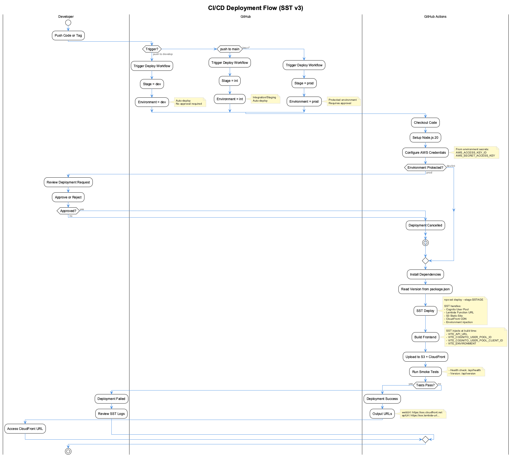

# AWS Deployment Guide

This guide walks you through deploying the UI Template application to AWS using SST v3.

## Architecture Overview


The application uses a serverless architecture with:

| Component | Purpose |
|-----------|---------|
| **CloudFront** | CDN for static assets |
| **S3** | Static website hosting |
| **Lambda** | Serverless API with Function URL |
| **Cognito** | User authentication |

## Prerequisites

### Required Tools

| Tool | Version | Installation |
|------|---------|--------------|
| Node.js | 18+ | `nvm install 18` |
| npm | 9+ | Included with Node.js |
| AWS CLI | 2.x | `brew install awscli` |

Verify installation:
```bash
node -v    # v18.x or higher
npm -v     # 9.x or higher
aws --version
```

### AWS Account Setup

You need an AWS account with IAM permissions for:
- Lambda
- S3
- CloudFront
- Cognito
- CloudWatch Logs
- IAM (for creating roles)

## Quick Deploy

### Option 1: Interactive Setup (Recommended)

```bash
npm run setup
```

This script will:
1. Check prerequisites
2. Verify AWS credentials
3. Let you choose authentication method (SSO or IAM)
4. Select deployment stage
5. Deploy everything automatically

### Option 2: Manual Commands

```bash
# Install dependencies
npm install

# Configure AWS (choose one)
aws configure                              # IAM user
aws sso login --profile your-profile       # SSO

# Deploy
npm run deploy           # Personal stage
npm run deploy:dev       # Dev environment
npm run deploy:int       # Integration/staging
npm run deploy:prod      # Production
```

## AWS Authentication

### Personal AWS Account (IAM User)

```bash
aws configure
# Enter:
#   AWS Access Key ID
#   AWS Secret Access Key
#   Default region: eu-central-1
#   Default output format: json
```

### Corporate SSO (AWS IAM Identity Center)

```bash
# One-time setup
aws configure sso
# Enter:
#   SSO session name: my-company
#   SSO start URL: https://my-company.awsapps.com/start
#   SSO region: eu-central-1

# Login before each session
aws sso login --profile your-profile
export AWS_PROFILE=your-profile

# Then deploy
npm run deploy
```

### Using Named Profiles

```bash
# Deploy with specific profile
AWS_PROFILE=tanfra npm run deploy

# Or use setup script
./scripts/setup.sh --profile tanfra
```

## Deployment Stages

| Stage | Command | Purpose |
|-------|---------|---------|
| Personal | `npm run deploy` | Your own dev environment (stage = username) |
| dev | `npm run deploy:dev` | Shared development |
| int | `npm run deploy:int` | Integration/staging |
| prod | `npm run deploy:prod` | Production |

### Stage-Specific Behavior

```typescript
// sst.config.ts
removal: input?.stage === "prod" ? "retain" : "remove",
protect: input?.stage === "prod",
```

- **Personal/Dev/Int**: Resources deleted on `sst remove`
- **Prod**: Resources retained, deletion protection enabled

## Deployment Outputs

After deployment, SST displays:

```text
✓  Complete
   Web: https://dz0qt8k015f75.cloudfront.net
   Api: https://xxx.lambda-url.eu-central-1.on.aws/
   ---
   apiUrl: https://xxx.lambda-url.eu-central-1.on.aws/
   stage: dev
   userPoolClientId: 18ho2tptqf8lm3mhnr89dtt2b9
   userPoolId: eu-central-1_xYfLflsEv
   webUrl: https://dz0qt8k015f75.cloudfront.net
```

| Output | Description |
|--------|-------------|
| `webUrl` | Your application URL (CloudFront) |
| `apiUrl` | Lambda Function URL for API |
| `userPoolId` | Cognito User Pool ID |
| `userPoolClientId` | Cognito Client ID |

## CI/CD Deployment (GitHub Actions)



The project uses GitHub Actions for automated deployments with environment protection.

### Deployment Triggers

| Action | Deploys To | Approval Required |
|--------|------------|-------------------|
| Push to `main` | **dev** | No (auto-deploy) |
| Tag `v*` (e.g., `v1.0.0`) | **prod** | Yes (manual approval) |
| Manual workflow dispatch | Selected stage | Depends on environment |

```bash
# Deploy to dev (automatic on push)
git add . && git commit -m "feat: new feature"
git push origin main

# Deploy to prod (requires approval)
git tag v1.0.0
git push origin v1.0.0
```

### Environment Protection Setup

Configure environments in GitHub for security and approval workflows.

#### Step 1: Create Environments

Go to **Repository Settings** → **Environments** → **New environment**

Create two environments:

| Environment | Protection Rules |
|-------------|-----------------|
| `dev` | None (auto-deploy) |
| `prod` | Required reviewers + optional wait timer |

#### Step 2: Add Secrets to Each Environment

For each environment, add these secrets:

| Secret | Description |
|--------|-------------|
| `AWS_ACCESS_KEY_ID` | AWS Access Key for this environment |
| `AWS_SECRET_ACCESS_KEY` | AWS Secret Key for this environment |

> **Security Note**: Environment secrets are isolated. You can use different AWS accounts for dev vs prod, or the same credentials for both.

#### Step 3: Configure Protection Rules (prod only)

For the `prod` environment:

1. Enable **Required reviewers** → Add yourself
2. Optionally enable **Wait timer** (e.g., 5-10 minutes)
3. Optionally restrict **Deployment branches** to `refs/tags/v*`

### How Approval Works

When you push a tag like `v1.0.0`:

1. GitHub Actions workflow starts
2. Reaches `prod` environment → **pauses for approval**
3. You receive notification (email if enabled)
4. Go to **Actions** tab → Click the waiting workflow
5. Click **Review deployments** → Check `prod` → **Approve and deploy**

This "pause and think" moment prevents accidental production deployments.

### Manual Deployment

You can also trigger deployments manually:

1. Go to **Actions** → **Deploy** workflow
2. Click **Run workflow**
3. Select stage (`dev` or `prod`)
4. Click **Run workflow**

### Workflow Files

| Workflow | Purpose | Trigger |
|----------|---------|---------|
| `.github/workflows/deploy.yml` | SST deployment to AWS | Code changes to main, tags |
| `.github/workflows/deploy-docs.yml` | MkDocs to GitHub Pages | Docs changes only |

The workflows are configured with `paths-ignore` so documentation changes don't trigger AWS deployments, and vice versa.

## Version Management

### Automatic Version Bumping

Deploy commands auto-increment the version:

```bash
npm run deploy:dev   # 1.0.0 → 1.0.1
npm run deploy:int   # 1.0.1 → 1.0.2
npm run deploy:prod  # 1.0.2 → 1.0.3
```

### Manual Version Control

```bash
npm run version:patch  # 1.0.0 → 1.0.1
npm run version:minor  # 1.0.0 → 1.1.0
npm run version:major  # 1.0.0 → 2.0.0
```

### Build-Time Injection

Version and environment are injected at build time via Vite:

```typescript
// vite.config.ts
define: {
  __APP_VERSION__: JSON.stringify(process.env.npm_package_version),
  __APP_BUILD_TIME__: JSON.stringify(new Date().toISOString()),
}
```

SST automatically sets environment variables for the frontend:

```typescript
// sst.config.ts
environment: {
  VITE_API_URL: api.url,
  VITE_COGNITO_USER_POOL_ID: userPool.id,
  VITE_COGNITO_USER_POOL_CLIENT_ID: userPoolClient.id,
  VITE_ENVIRONMENT: $app.stage,
}
```

## Development Workflow

### Local Development with SST

```bash
npm run dev
```

This starts:

- Vite dev server at `http://localhost:5173`
- SST connects to real AWS resources
- Changes deploy instantly (Live Lambda Development)

### Local-Only Development

```bash
npm run dev:local    # Frontend only
npm run start        # Frontend + local mock API
```

## Infrastructure Configuration

### SST Config (`sst.config.ts`)

```typescript
export default $config({
  app(input) {
    return {
      name: "ui-template",
      removal: input?.stage === "prod" ? "retain" : "remove",
      protect: input?.stage === "prod",
      home: "aws",
      providers: { aws: { region: "eu-central-1" } },
    };
  },
  async run() {
    // Cognito User Pool
    const userPool = new sst.aws.CognitoUserPool("Auth", {
      usernames: ["email"],
    });

    // Lambda API
    const api = new sst.aws.Function("Api", {
      handler: "lambda/api/index.handler",
      url: true,
    });

    // Static Site
    new sst.aws.StaticSite("Web", {
      build: { command: "npm run build", output: "dist" },
      environment: {
        VITE_API_URL: api.url,
        VITE_COGNITO_USER_POOL_ID: userPool.id,
      },
    });
  },
});
```

### Cognito Configuration

The User Pool is configured with:

- Email-based authentication
- Password policy (8+ chars, upper/lower/numbers)
- Email verification
- 1-hour access tokens, 30-day refresh tokens

## Post-Deployment Tasks

### Create Admin User

```bash
aws cognito-idp admin-create-user \
  --user-pool-id eu-central-1_xYfLflsEv \
  --username admin@example.com \
  --user-attributes Name=email,Value=admin@example.com \
  --temporary-password "TempPass123!"

# Set permanent password
aws cognito-idp admin-set-user-password \
  --user-pool-id eu-central-1_xYfLflsEv \
  --username admin@example.com \
  --password "SecurePassword123!" \
  --permanent
```

### Custom Domain (Optional)

1. Request SSL certificate in ACM (must be in `us-east-1`)
2. Add domain to `sst.config.ts`:
   ```typescript
   new sst.aws.StaticSite("Web", {
     domain: "app.yourdomain.com",
     // ...
   });
   ```
3. Configure DNS to point to CloudFront

## Troubleshooting

### Common Issues

#### SST Lock Error

```bash
# If previous deployment was interrupted
npx sst unlock --stage dev
```

#### AWS Credentials Not Found

```bash
# Verify credentials
aws sts get-caller-identity

# For SSO
aws sso login --profile your-profile
export AWS_PROFILE=your-profile
```

#### Quarantine Policy (Access Denied)

If you see `AWSCompromisedKeyQuarantineV3` errors:

1. Your credentials were exposed publicly
2. Rotate your access keys in IAM Console
3. Remove the quarantine policy via AWS Console

#### CORS Errors

The Lambda Function URL is configured with permissive CORS:

```typescript
url: {
  cors: {
    allowOrigins: ["*"],
    allowMethods: ["*"],
    allowHeaders: ["*"],
  },
}
```

For production, restrict to your domain.

### Viewing Logs

```bash
# SST deployment logs
cat .sst/log/sst.log

# Lambda logs (via AWS Console or CLI)
aws logs tail /aws/lambda/ui-template-dev-ApiFunction --follow
```

### SST Console

View deployment status and logs at:

```text
https://sst.dev/u/<deployment-id>
```

## Cleanup

### Remove a Single Stage

```bash
npm run remove           # Personal stage
npm run remove:dev       # Dev
npm run remove:int       # Int
npm run remove:prod      # Prod (protected, requires confirmation)
```

### Remove All Stages

```bash
npx sst remove --stage dev
npx sst remove --stage int
npx sst remove --stage prod
```

## Quick Reference

### Commands

| Command | Description |
|---------|-------------|
| `npm run setup` | Interactive setup and deploy |
| `npm run dev` | Start with SST (live AWS) |
| `npm run dev:local` | Start Vite only |
| `npm run deploy` | Deploy to personal stage |
| `npm run deploy:dev` | Deploy to dev |
| `npm run deploy:int` | Deploy to int |
| `npm run deploy:prod` | Deploy to prod |
| `npm run remove` | Remove deployment |

### SST Commands

| Command | Description |
|---------|-------------|
| `npx sst deploy` | Deploy current stage |
| `npx sst remove` | Remove current stage |
| `npx sst dev` | Start dev mode |
| `npx sst diff` | Show pending changes |
| `npx sst unlock` | Release deployment lock |

### File Structure

```text
ui-template/
├── sst.config.ts         # SST infrastructure config
├── scripts/
│   └── setup.sh          # Interactive setup script
├── lambda/
│   └── api/              # Lambda function code
├── src/                  # React frontend
└── docs/                 # Documentation
```

## Migration from SAM

If you previously used SAM, the following files are no longer needed:

- `template.yaml` - Replaced by `sst.config.ts`
- `samconfig.toml` - SST manages state automatically
- `.aws-sam/` - SST uses `.sst/` directory

The `sam:*` npm scripts have been replaced with SST equivalents:

- `sam:deploy:dev` → `deploy:dev`
- `sam:deploy:int` → `deploy:int`
- `sam:deploy:prod` → `deploy:prod`
