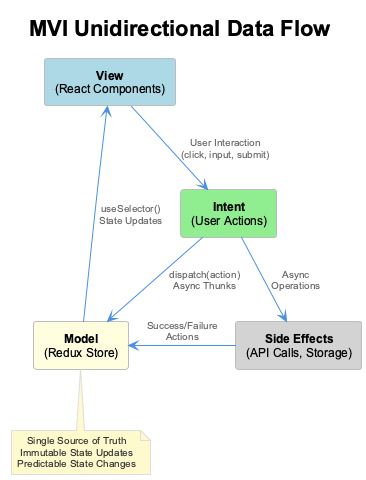
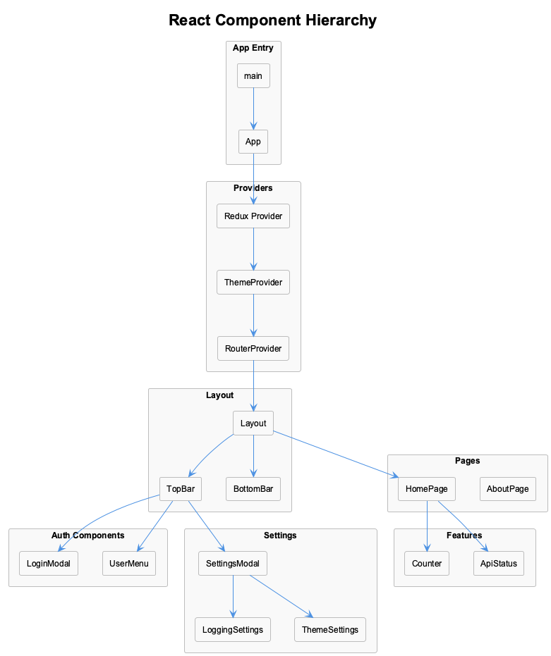
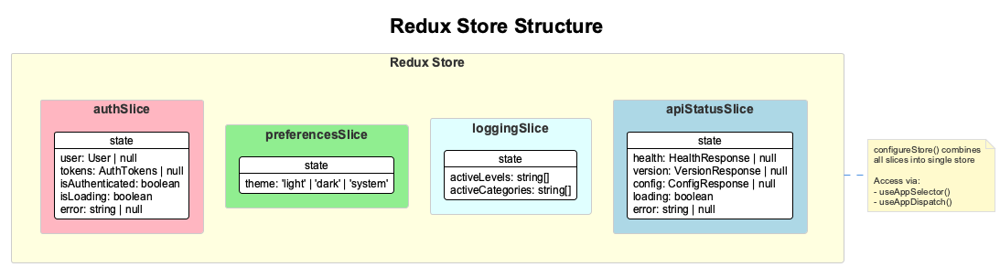
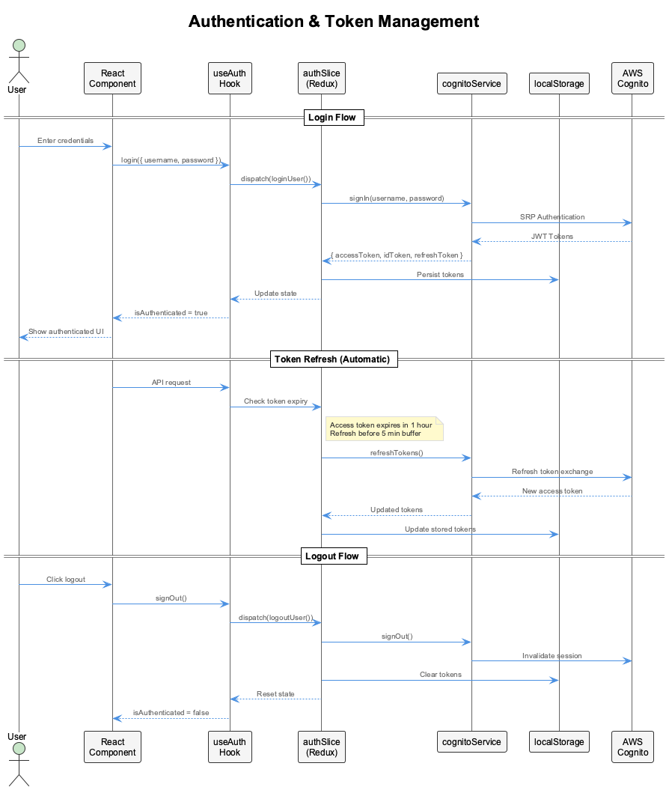
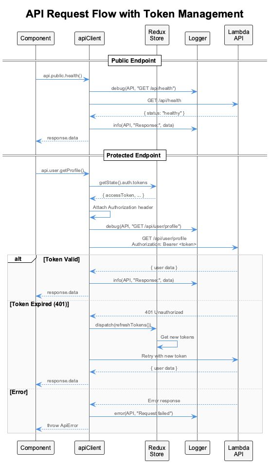
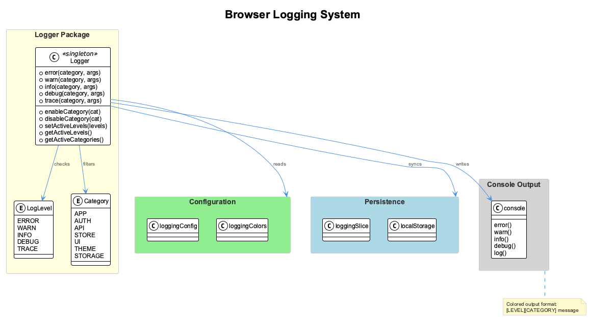

# Frontend Architecture

This document explains the architectural patterns and design decisions used in the UI template.

## MVI Pattern & Unidirectional Data Flow

The application follows the **Model-View-Intent (MVI)** pattern with unidirectional data flow:



| Layer | Responsibility | Implementation |
|-------|---------------|----------------|
| **View** | Render UI, capture user interactions | React components |
| **Intent** | Transform user actions into state changes | Action dispatches, async thunks |
| **Model** | Single source of truth for app state | Redux store |

**Data flows in one direction only:**

1. **View** captures user interaction (click, input, form submit)
2. **Intent** dispatches an action or async thunk
3. **Model** updates state via reducers
4. **View** re-renders with new state via `useSelector()`

This pattern ensures predictable state management and makes debugging straightforward.

---

## Component Hierarchy



The component tree follows this structure:

```text
main.tsx
└── App.tsx
    └── Redux Provider
        └── ThemeProvider
            └── RouterProvider
                └── Layout
                    ├── TopBar (LoginModal, UserMenu, SettingsModal)
                    ├── Page Content (HomePage, AboutPage)
                    └── BottomBar
```

**Key patterns:**

- **Providers wrap the entire app** - Redux, Theme, and Router contexts available everywhere
- **Layout handles structure** - Consistent TopBar and BottomBar across all pages
- **Feature components are self-contained** - Counter, ApiStatus manage their own state access

---

## Redux Store Structure

State management uses Redux Toolkit with typed slices:



### Slices Overview

| Slice | Purpose | Key State |
|-------|---------|-----------|
| `authSlice` | User authentication | `user`, `tokens`, `isAuthenticated` |
| `preferencesSlice` | User preferences | `theme` (light/dark/system) |
| `loggingSlice` | Console logging control | `activeLevels`, `activeCategories` |
| `apiStatusSlice` | API health monitoring | `health`, `version`, `config` |

### Typed Hooks

```typescript
// src/store/hooks.ts
export const useAppDispatch = () => useDispatch<AppDispatch>();
export const useAppSelector: TypedUseSelectorHook<RootState> = useSelector;
```

Usage in components:

```typescript
const isAuthenticated = useAppSelector((state) => state.auth.isAuthenticated);
const dispatch = useAppDispatch();
dispatch(loginUser({ username, password }));
```

---

## Authentication & Token Management

The app uses AWS Cognito for authentication with JWT tokens:



### Token Types

| Token | Purpose | Lifetime |
|-------|---------|----------|
| **Access Token** | API authorization | 1 hour |
| **ID Token** | User identity claims | 1 hour |
| **Refresh Token** | Get new access tokens | 30 days |

### Authentication Flow

1. **Login** - User credentials sent to Cognito via SRP authentication
2. **Token Storage** - Tokens persisted to localStorage
3. **Auto-Refresh** - Access token refreshed before expiry (5-min buffer)
4. **Logout** - Tokens cleared, Cognito session invalidated

### Using Authentication

```typescript
// src/hooks/useAuth.ts
const { user, isAuthenticated, login, signOut } = useAuth();

// Login
await login({ username: 'user@example.com', password: 'secret' });

// Protected content
if (isAuthenticated) {
  console.log(`Hello ${user.email}`);
}
```

---

## API Request Flow

API calls handle authentication automatically:



### API Client Structure

```typescript
// src/services/apiClient.ts
export const api = {
  public: {
    health: () => client.get('/api/health'),
    version: () => client.get('/api/version'),
  },
  user: {
    getProfile: () => authClient.get('/api/user/profile'),
  },
};
```

### Request Handling

| Scenario | Behavior |
|----------|----------|
| Public endpoint | Direct request, no auth header |
| Protected endpoint | Attach `Authorization: Bearer <token>` |
| Token expired (401) | Auto-refresh tokens, retry request |
| Request failure | Log error, throw `ApiError` |

---

## Browser Logging System

The custom Logger provides categorized, colored console output:



### Log Levels

```typescript
Logger.error('AUTH', 'Login failed:', error);  // Always shown
Logger.warn('API', 'Slow response:', ms);       // Important warnings
Logger.info('STORE', 'State updated');          // General info
Logger.debug('UI', 'Component rendered');       // Debugging
Logger.trace('THEME', 'Color calculated');      // Verbose tracing
```

### Categories

| Category | Use Case |
|----------|----------|
| `APP` | Application lifecycle |
| `AUTH` | Authentication events |
| `API` | Network requests |
| `STORE` | Redux state changes |
| `UI` | Component rendering |
| `THEME` | Theme switching |
| `STORAGE` | localStorage operations |

### Runtime Configuration

Users can enable/disable logging via the Settings modal:

```typescript
// Programmatic control
Logger.setActiveLevels(['ERROR', 'WARN', 'INFO']);
Logger.enableCategory('API');
Logger.disableCategory('THEME');
```

Settings persist to localStorage and sync with Redux state.

---

## Browser Persistence

User preferences persist across sessions:

| Data | Storage | Redux Slice |
|------|---------|-------------|
| Auth tokens | localStorage | `authSlice` |
| Theme preference | localStorage | `preferencesSlice` |
| Logging settings | localStorage | `loggingSlice` |

### Persistence Flow

1. **On app load** - Read from localStorage, hydrate Redux store
2. **On state change** - Middleware syncs to localStorage
3. **On logout** - Clear auth data, preserve preferences

---

## Summary

| Pattern | Implementation | Benefit |
|---------|---------------|---------|
| MVI | Redux + React | Predictable state flow |
| Typed State | TypeScript + Redux Toolkit | Type safety |
| JWT Auth | Cognito + auto-refresh | Secure API access |
| Logging | Custom Logger class | Debuggable output |
| Persistence | localStorage sync | Session continuity |
