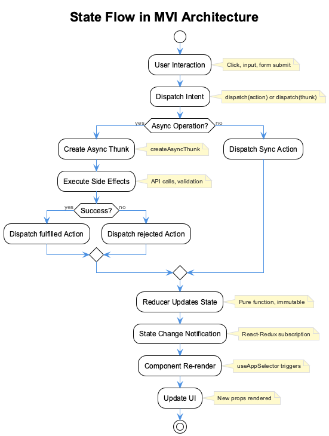
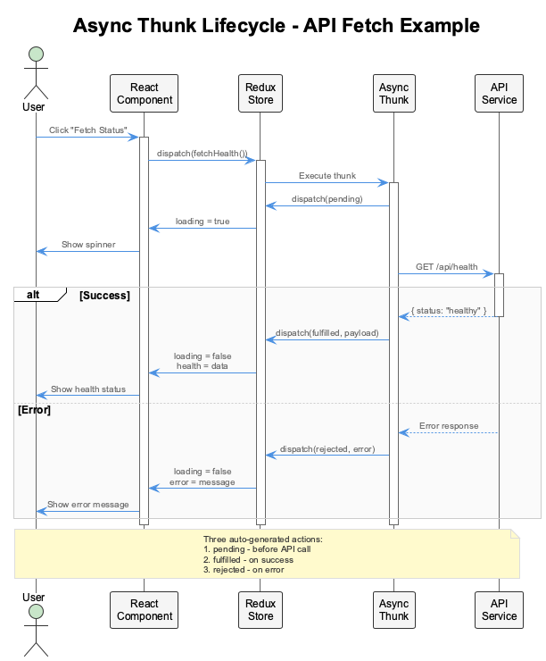
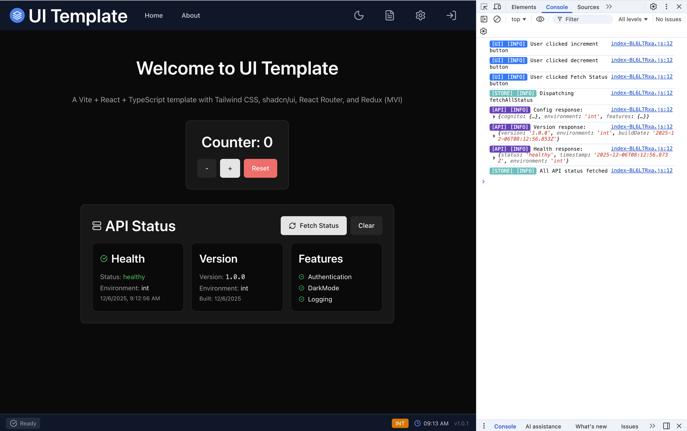
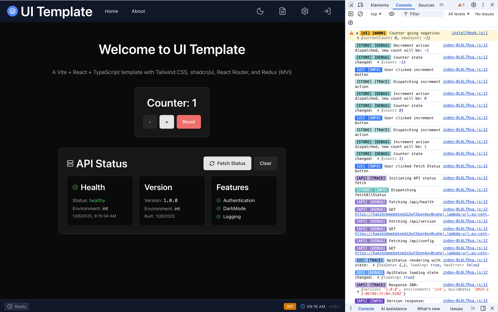
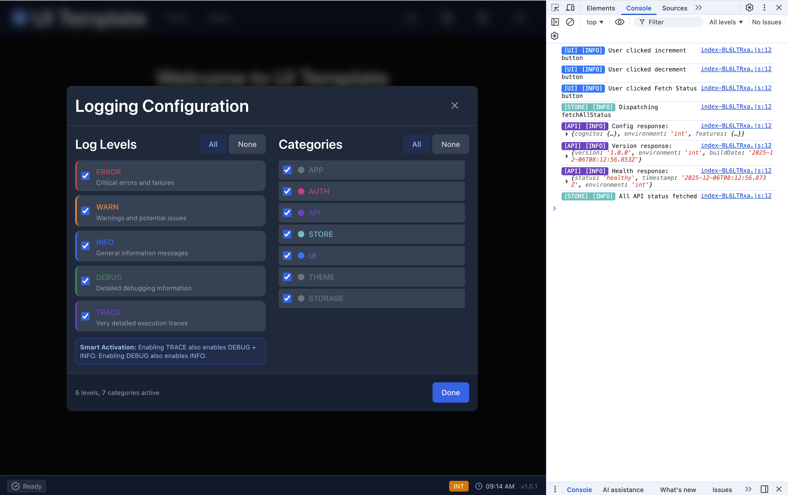
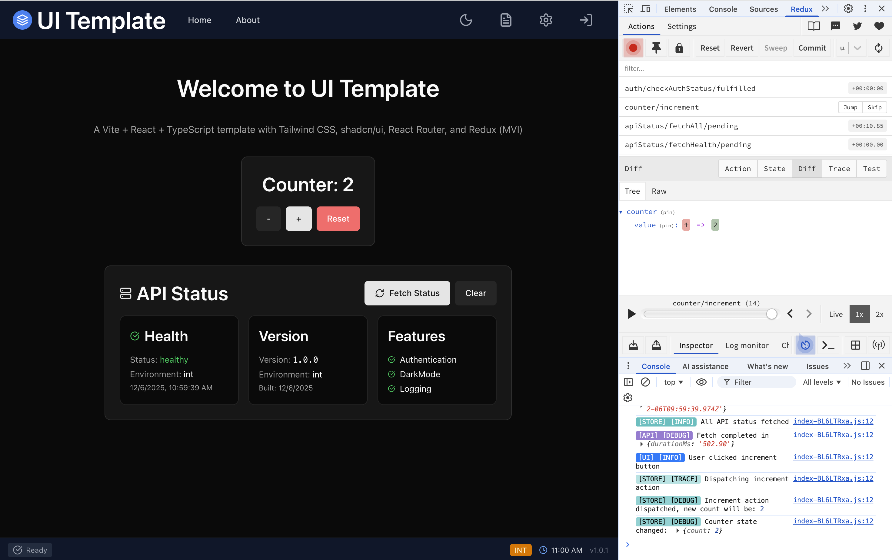
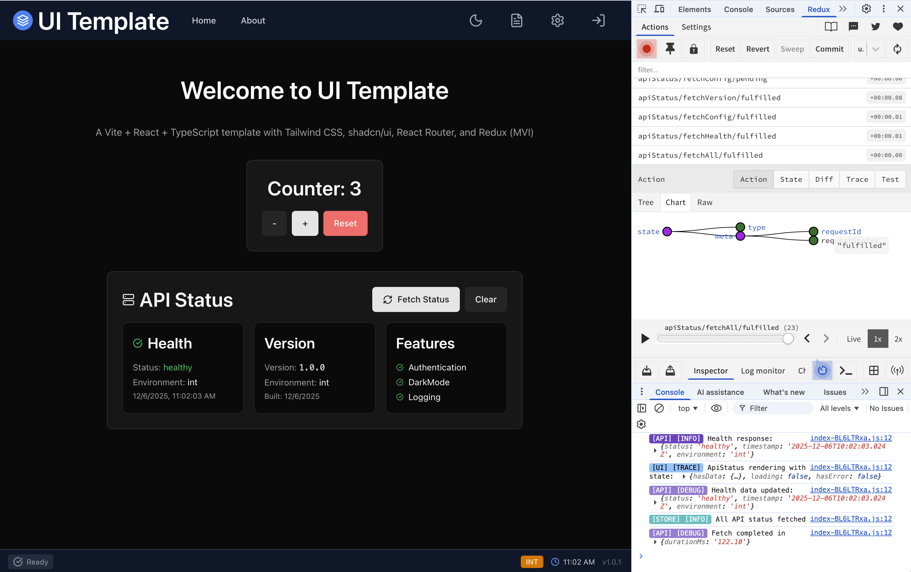
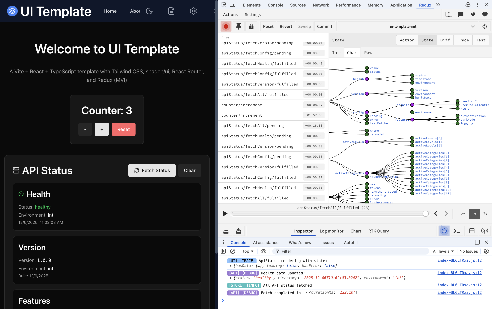

# Frontend Architecture

This guide covers the architectural patterns, state management, and development practices used in the UI Template. Understanding these concepts will help you build maintainable, scalable React applications.

## Overview

The UI Template demonstrates modern frontend architecture with:

| Concept | Implementation | Benefit |
|---------|----------------|---------|
| **State Management** | Redux Toolkit | Predictable, debuggable state |
| **Data Flow** | MVI (Model-View-Intent) | Unidirectional, traceable updates |
| **Async Operations** | createAsyncThunk | Automatic loading/error states |
| **Type Safety** | TypeScript | Compile-time error detection |
| **Authentication** | AWS Cognito + JWT | Secure, token-based auth |
| **Debugging** | Redux DevTools | Time-travel debugging |

### Key Architecture Diagram


### What You'll Learn

- [MVI Pattern](#mvi-pattern--unidirectional-data-flow) - How data flows through the application
- [Redux Store](#redux-store--state-management) - Configuring and using the store
- [Async Thunks](#async-thunks-createasyncthunk) - Handling API calls and side effects
- [Authentication](#authentication-with-async-thunks) - JWT-based auth with Cognito
- [Logging System](#browser-logging-system) - Categorized console output
- [Time-Travel Debugging](#time-travel-debugging-with-redux-devtools) - Using Redux DevTools

---

## MVI Pattern & Unidirectional Data Flow

The application follows the **Model-View-Intent (MVI)** pattern with unidirectional data flow:


| Layer | Responsibility | Implementation |
|-------|---------------|----------------|
| **View** | Render UI, capture user interactions | React components |
| **Intent** | Transform user actions into state changes | Action dispatches, async thunks |
| **Model** | Single source of truth for app state | Redux store |

**Data flows in one direction only:**

1. **View** captures user interaction (click, input, form submit)
2. **Intent** dispatches an action or async thunk
3. **Model** updates state via reducers
4. **View** re-renders with new state via `useSelector()`

This pattern ensures predictable state management and makes debugging straightforward.

### State Flow Diagram



---

## Redux Store & State Management

State management uses [Redux Toolkit](https://redux-toolkit.js.org/) with typed slices. Redux Toolkit is the official, opinionated toolset for efficient Redux development.


### Store Configuration

```typescript
// src/store/index.ts
import { configureStore } from '@reduxjs/toolkit';
import authReducer from './slices/authSlice';
import preferencesReducer from './slices/preferencesSlice';
import loggingReducer from './slices/loggingSlice';
import { apiStatusReducer } from '@/features/api-status';

export const store = configureStore({
  reducer: {
    auth: authReducer,
    preferences: preferencesReducer,
    logging: loggingReducer,
    apiStatus: apiStatusReducer,
  },
  middleware: (getDefaultMiddleware) =>
    getDefaultMiddleware({
      serializableCheck: false,
    }),
});

export type RootState = ReturnType<typeof store.getState>;
export type AppDispatch = typeof store.dispatch;
```

### Typed Hooks

Always use typed hooks for type safety:

```typescript
// src/store/index.ts
import { useDispatch, useSelector } from 'react-redux';
import type { TypedUseSelectorHook } from 'react-redux';

export const useAppDispatch = () => useDispatch<AppDispatch>();
export const useAppSelector: TypedUseSelectorHook<RootState> = useSelector;
```

### Slices Overview

| Slice | Purpose | Key State |
|-------|---------|-----------|
| `authSlice` | User authentication | `user`, `tokens`, `isAuthenticated` |
| `preferencesSlice` | User preferences | `theme` (light/dark/system) |
| `loggingSlice` | Console logging control | `activeLevels`, `activeCategories` |
| `apiStatusSlice` | API health monitoring | `health`, `version`, `config` |

---

## Async Thunks (createAsyncThunk)

For async operations like API calls, use [createAsyncThunk](https://redux-toolkit.js.org/api/createAsyncThunk). It automatically generates `pending`, `fulfilled`, and `rejected` action types.



### Creating an Async Thunk

```typescript
// src/features/api-status/apiStatusSlice.ts
import { createSlice, createAsyncThunk } from '@reduxjs/toolkit';
import { api } from '@/services/apiClient';
import { Logger } from '@/utils/logging';

// Define response types
interface HealthResponse {
  status: string;
  timestamp: string;
  environment: string;
}

// Create the async thunk
export const fetchHealth = createAsyncThunk(
  'apiStatus/fetchHealth',  // Action type prefix
  async (_, { rejectWithValue }) => {
    try {
      Logger.debug(Logger.Categories.API, 'Fetching /api/health');
      const response = await api.public.health();
      Logger.info(Logger.Categories.API, 'Health response:', response.data);
      return response.data as HealthResponse;
    } catch (error) {
      Logger.error(Logger.Categories.API, 'Health fetch failed:', error);
      return rejectWithValue(
        error instanceof Error ? error.message : 'Failed to fetch health'
      );
    }
  }
);
```

### Handling Thunk States in Reducers

```typescript
// src/features/api-status/apiStatusSlice.ts
interface ApiStatusState {
  health: HealthResponse | null;
  loading: boolean;
  error: string | null;
  lastFetched: number | null;
}

const initialState: ApiStatusState = {
  health: null,
  loading: false,
  error: null,
  lastFetched: null,
};

const apiStatusSlice = createSlice({
  name: 'apiStatus',
  initialState,
  reducers: {
    clearStatus: (state) => {
      state.health = null;
      state.error = null;
    },
  },
  extraReducers: (builder) => {
    builder
      // Handle pending state
      .addCase(fetchHealth.pending, (state) => {
        state.loading = true;
        state.error = null;
      })
      // Handle success
      .addCase(fetchHealth.fulfilled, (state, action) => {
        state.health = action.payload;
        state.loading = false;
        state.lastFetched = Date.now();
      })
      // Handle error
      .addCase(fetchHealth.rejected, (state, action) => {
        state.loading = false;
        state.error = action.payload as string;
      });
  },
});
```

### Dispatching Multiple Thunks

```typescript
// Dispatch multiple thunks in parallel
export const fetchAllStatus = createAsyncThunk(
  'apiStatus/fetchAll',
  async (_, { dispatch }) => {
    await Promise.all([
      dispatch(fetchHealth()),
      dispatch(fetchVersion()),
      dispatch(fetchConfig()),
    ]);
  }
);
```

### Using Thunks in Components

```typescript
// src/features/api-status/ApiStatus.tsx
import { useEffect } from 'react';
import { useAppDispatch, useAppSelector } from '@/store';
import { fetchAllStatus, selectHealth, selectLoading, selectError } from './apiStatusSlice';

export function ApiStatus() {
  const dispatch = useAppDispatch();
  const health = useAppSelector(selectHealth);
  const loading = useAppSelector(selectLoading);
  const error = useAppSelector(selectError);

  useEffect(() => {
    dispatch(fetchAllStatus());
  }, [dispatch]);

  if (loading) return <Spinner />;
  if (error) return <ErrorMessage message={error} />;
  if (!health) return null;

  return (
    <div>
      <p>Status: {health.status}</p>
      <p>Environment: {health.environment}</p>
    </div>
  );
}
```

### Selectors

Define selectors for reusable state access:

```typescript
// src/features/api-status/apiStatusSlice.ts
import type { RootState } from '@/store';

export const selectApiStatus = (state: RootState) => state.apiStatus;
export const selectHealth = (state: RootState) => state.apiStatus.health;
export const selectVersion = (state: RootState) => state.apiStatus.version;
export const selectLoading = (state: RootState) => state.apiStatus.loading;
export const selectError = (state: RootState) => state.apiStatus.error;
```

---

## Authentication with Async Thunks

The auth slice demonstrates a complete async thunk implementation:


### Login Thunk

```typescript
// src/store/slices/authSlice.ts
export const loginUser = createAsyncThunk(
  'auth/loginUser',
  async (credentials: LoginCredentials, { rejectWithValue }) => {
    try {
      const result = await cognitoService.signIn(credentials);
      return {
        user: mapCognitoUserToUser(result.user),
        tokens: result.tokens,
      };
    } catch (error: unknown) {
      const err = error as { message?: string };
      return rejectWithValue(err.message || 'Login failed');
    }
  }
);
```

### Auth State Management

```typescript
// src/store/slices/authSlice.ts
export interface AuthState {
  user: User | null;
  tokens: AuthTokens | null;
  isAuthenticated: boolean;
  isLoading: boolean;
  error: string | null;
  loginAttempts: number;
  pendingVerification: { username: string; email: string } | null;
}

const authSlice = createSlice({
  name: 'auth',
  initialState,
  reducers: {
    clearError: (state) => { state.error = null; },
    incrementLoginAttempts: (state) => { state.loginAttempts += 1; },
  },
  extraReducers: (builder) => {
    builder
      .addCase(loginUser.pending, (state) => {
        state.isLoading = true;
        state.error = null;
      })
      .addCase(loginUser.fulfilled, (state, action) => {
        state.isLoading = false;
        state.user = action.payload.user;
        state.tokens = action.payload.tokens;
        state.isAuthenticated = true;
        state.loginAttempts = 0;
        // Persist to localStorage
        localStorage.setItem('auth_state', JSON.stringify({
          user: state.user,
          tokens: state.tokens,
          isAuthenticated: true,
        }));
      })
      .addCase(loginUser.rejected, (state, action) => {
        state.isLoading = false;
        state.error = action.payload as string;
        state.loginAttempts += 1;
      });
  },
});
```

### Token Types

| Token | Purpose | Lifetime |
|-------|---------|----------|
| **Access Token** | API authorization | 1 hour |
| **ID Token** | User identity claims | 1 hour |
| **Refresh Token** | Get new access tokens | 30 days |

### Using the useAuth Hook

```typescript
// src/hooks/useAuth.ts
const { user, isAuthenticated, login, signOut } = useAuth();

// Login
await login({ username: 'user@example.com', password: 'secret' });

// Protected content
if (isAuthenticated) {
  console.log(`Hello ${user.email}`);
}
```

---

## Component Hierarchy


```text
main.tsx
└── App.tsx
    └── Redux Provider
        └── ThemeProvider
            └── RouterProvider
                └── Layout
                    ├── TopBar (LoginModal, UserMenu, SettingsModal)
                    ├── Page Content (HomePage, AboutPage)
                    └── BottomBar
```

**Key patterns:**

- **Providers wrap the entire app** - Redux, Theme, and Router contexts available everywhere
- **Layout handles structure** - Consistent TopBar and BottomBar across all pages
- **Feature components are self-contained** - Counter, ApiStatus manage their own state access

---

## API Request Flow

API calls handle authentication automatically:


### API Client Structure

```typescript
// src/services/apiClient.ts
export const api = {
  public: {
    health: () => client.get('/api/health'),
    version: () => client.get('/api/version'),
    config: () => client.get('/api/config'),
  },
  user: {
    getProfile: () => authClient.get('/api/user/profile'),
  },
};
```

### Request Handling

| Scenario | Behavior |
|----------|----------|
| Public endpoint | Direct request, no auth header |
| Protected endpoint | Attach `Authorization: Bearer <token>` |
| Token expired (401) | Auto-refresh tokens, retry request |
| Request failure | Log error, throw `ApiError` |

---

## Browser Logging System

The custom Logger provides categorized, colored console output:


### Log Levels

| Level | Purpose | When to Use |
|-------|---------|-------------|
| **ERROR** | Critical failures | Authentication failures, API errors |
| **WARN** | Potential issues | Slow responses, edge cases |
| **INFO** | Key events | User actions, state changes |
| **DEBUG** | Detailed info | Data updates, action results |
| **TRACE** | Verbose tracing | Component lifecycle, renders |

```typescript
Logger.error(Logger.Categories.AUTH, 'Login failed:', error);  // Always shown
Logger.warn(Logger.Categories.API, 'Slow response:', ms);       // Important warnings
Logger.info(Logger.Categories.STORE, 'State updated');          // General info
Logger.debug(Logger.Categories.UI, 'Component rendered');       // Debugging
Logger.trace(Logger.Categories.THEME, 'Color calculated');      // Verbose tracing
```

### Console Output Examples

**INFO level logs** - User interactions and key events:


*Console showing INFO level logs from Counter and API Status interactions*

**All verbosity levels enabled** - Complete trace of application behavior:


*Console showing WARN, DEBUG, TRACE, and INFO logs demonstrating the full logging hierarchy*

### Categories

| Category | Use Case |
|----------|----------|
| `APP` | Application lifecycle |
| `AUTH` | Authentication events |
| `API` | Network requests |
| `STORE` | Redux state changes |
| `UI` | Component rendering |
| `THEME` | Theme switching |
| `STORAGE` | localStorage operations |

### Runtime Configuration

Configure logging via the Settings modal:


*Settings modal with Log Levels and Categories toggles*

```typescript
// Programmatic control
Logger.setActiveLevels(['ERROR', 'WARN', 'INFO']);
Logger.enableCategory('API');
Logger.disableCategory('THEME');
```

Settings persist to localStorage and sync with Redux state.

---

## Browser Persistence

User preferences persist across sessions:

| Data | Storage | Redux Slice |
|------|---------|-------------|
| Auth tokens | localStorage | `authSlice` |
| Theme preference | localStorage | `preferencesSlice` |
| Logging settings | localStorage | `loggingSlice` |

### Persistence Flow

1. **On app load** - Read from localStorage, hydrate Redux store
2. **On state change** - Reducer syncs to localStorage
3. **On logout** - Clear auth data, preserve preferences

### Hydrating State from Storage

```typescript
// src/store/slices/authSlice.ts
const loadAuthFromStorage = (): Partial<AuthState> => {
  try {
    const storedAuth = localStorage.getItem('auth_state');
    if (storedAuth) {
      const parsed = JSON.parse(storedAuth);
      if (parsed.user && parsed.isAuthenticated && parsed.tokens?.accessToken) {
        return {
          user: parsed.user,
          tokens: parsed.tokens,
          isAuthenticated: true,
        };
      }
    }
  } catch (error) {
    Logger.warn(Logger.Categories.STORAGE, 'Failed to load auth state');
    localStorage.removeItem('auth_state');
  }
  return {};
};

const initialState: AuthState = {
  user: null,
  tokens: null,
  isAuthenticated: false,
  // ... other defaults
  ...loadAuthFromStorage(),  // Hydrate from storage
};
```

---

## Time-Travel Debugging with Redux DevTools

One of the most powerful benefits of the MVI/Redux architecture is **time-travel debugging**. Since all state changes flow through actions, you can replay, rewind, and inspect every state transition in your application.

### What is Time-Travel Debugging?

With Redux DevTools, you can:

- **Replay actions** - Step through every action that modified state
- **Jump to any point** - Click on any past action to see the state at that moment
- **Inspect state diffs** - See exactly what changed between actions
- **Export/Import state** - Save and restore entire application states
- **Skip actions** - Temporarily disable actions to see alternate outcomes

### Installing Redux DevTools

#### Chrome Extension

1. Visit the [Chrome Web Store](https://chrome.google.com/webstore/detail/redux-devtools/lmhkpmbekcpmknklioeibfkpmmfibljd)
2. Click **"Add to Chrome"**
3. The Redux icon appears in your browser toolbar

#### Firefox Extension

1. Visit [Firefox Add-ons](https://addons.mozilla.org/en-US/firefox/addon/reduxdevtools/)
2. Click **"Add to Firefox"**

#### Edge Extension

1. Visit [Edge Add-ons](https://microsoftedge.microsoft.com/addons/detail/redux-devtools/nnkgneoiohoecpdiaponcejilbhhikei)
2. Click **"Get"**

### Using Redux DevTools

After installing, open your browser's Developer Tools (F12) and look for the **Redux** tab.


*Redux DevTools showing action history, state diff, and time-travel slider*

#### Action History

The left panel shows all dispatched actions in chronological order. Each action displays:

- **Action type** (e.g., `counter/increment`, `apiStatus/fetchHealth/fulfilled`)
- **Timestamp** when the action was dispatched
- **Payload data** sent with the action


*Action tab with Chart view showing action structure and relationships*

#### State Inspector

Click on any action to inspect the state at that point:


*Full state tree visualization showing all slices and their relationships*

The **Diff** tab shows what changed between actions (visible in the first screenshot above):

```diff
  counter: {
-   value: 1
+   value: 2
  }
```

#### Time-Travel Controls

Use the slider or buttons to travel through time:

| Control | Action |
|---------|--------|
| **Play/Pause** | Auto-replay actions |
| **Step Back** | Go to previous action |
| **Step Forward** | Go to next action |
| **Jump** | Click any action to jump directly |
| **Skip** | Toggle action on/off without removing |

### Store Configuration

Redux Toolkit's `configureStore` automatically enables DevTools in development:

```typescript
// src/store/index.ts
import { configureStore } from '@reduxjs/toolkit';

export const store = configureStore({
  reducer: {
    counter: counterReducer,
    apiStatus: apiStatusReducer,
    auth: authReducer,
    // ...
  },
  // DevTools enabled by default in development
  // Disabled in production builds automatically
});
```

#### Custom DevTools Options

For advanced configuration:

```typescript
export const store = configureStore({
  reducer: rootReducer,
  devTools: {
    name: 'UI Template',           // Custom name in DevTools
    maxAge: 50,                    // Max actions to keep
    trace: true,                   // Include stack traces
    traceLimit: 25,                // Stack trace depth
  },
});
```

### Debugging Workflow Example

**Scenario**: Counter is showing wrong value after API fetch

1. **Open Redux DevTools** in browser
2. **Reproduce the bug** by clicking Counter and Fetch Status
3. **Find the problematic action** in the history
4. **Inspect the state diff** to see unexpected changes
5. **Jump back** to before the issue occurred
6. **Step forward** one action at a time to isolate the cause

### Export/Import State

Save application state for bug reports:

1. Click the **Export** button (download icon)
2. Save the JSON file
3. Share with team or attach to bug report
4. **Import** to restore exact state for debugging

### Best Practices

| Practice | Benefit |
|----------|---------|
| Use descriptive action names | Easy to find in history |
| Keep actions small | Clearer state diffs |
| Log async thunk lifecycle | See pending/fulfilled/rejected flow |
| Disable in production | Performance and security |

### Additional Tools

| Tool | Purpose | Link |
|------|---------|------|
| **React Developer Tools** | Component inspection | [Chrome](https://chrome.google.com/webstore/detail/react-developer-tools/fmkadmapgofadopljbjfkapdkoienihi) |
| **Redux DevTools** | State time-travel | [Chrome](https://chrome.google.com/webstore/detail/redux-devtools/lmhkpmbekcpmknklioeibfkpmmfibljd) |
| **React Profiler** | Performance analysis | Built into React DevTools |

---

## References

### Official Documentation

- [Redux Toolkit Documentation](https://redux-toolkit.js.org/)
- [createAsyncThunk API Reference](https://redux-toolkit.js.org/api/createAsyncThunk)
- [Redux Essentials: Async Logic](https://redux.js.org/tutorials/essentials/part-5-async-logic)
- [Usage with TypeScript](https://redux-toolkit.js.org/usage/usage-with-typescript)
- [Redux DevTools Extension](https://github.com/reduxjs/redux-devtools)

### Best Practices

- [Redux Toolkit Usage Guide](https://redux-toolkit.js.org/usage/usage-guide)
- [RTK Query for Data Fetching](https://redux-toolkit.js.org/rtk-query/overview) - Consider for complex data fetching needs
- [Mastering Redux DevTools](https://30dayscoding.com/blog/mastering-redux-devtools-extension-a-comprehensive-guide)

---

## Summary

| Pattern | Implementation | Benefit |
|---------|---------------|---------|
| MVI | Redux + React | Predictable state flow |
| Async Thunks | createAsyncThunk | Automatic pending/fulfilled/rejected |
| Typed State | TypeScript + Redux Toolkit | Type safety |
| JWT Auth | Cognito + auto-refresh | Secure API access |
| Logging | Custom Logger class | Debuggable output |
| Persistence | localStorage sync | Session continuity |
