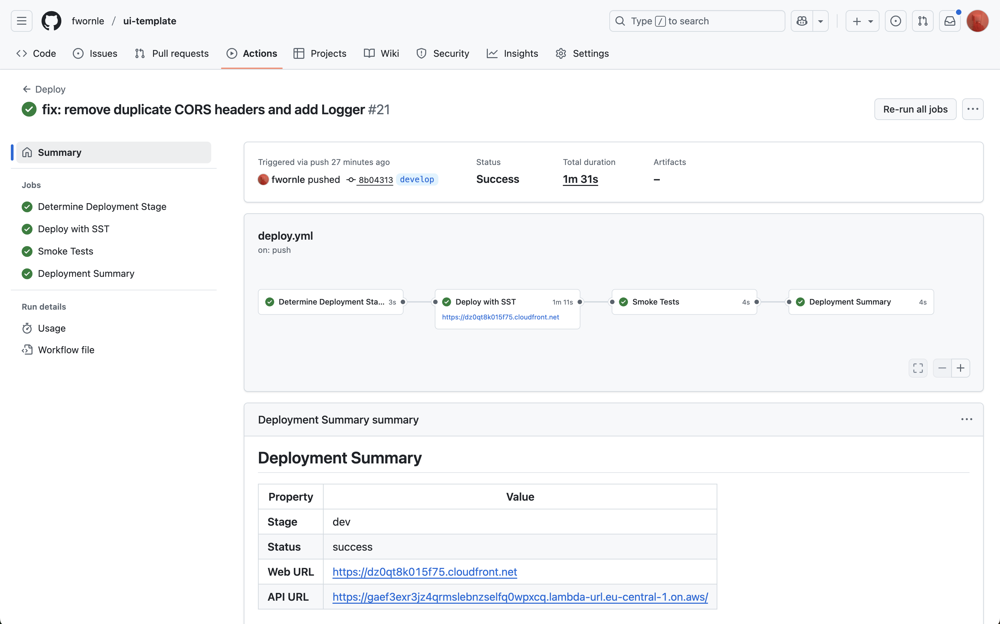
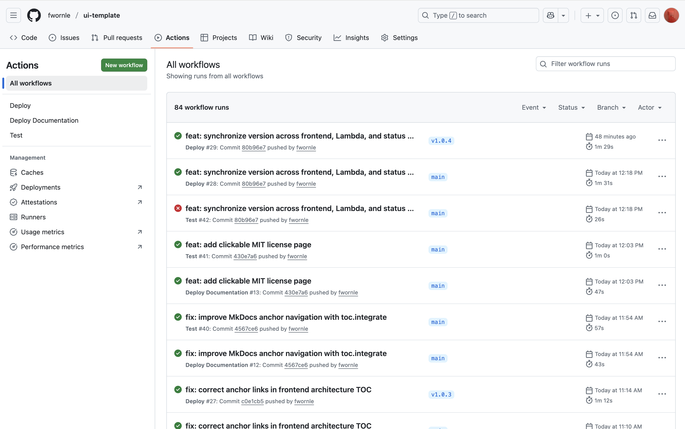
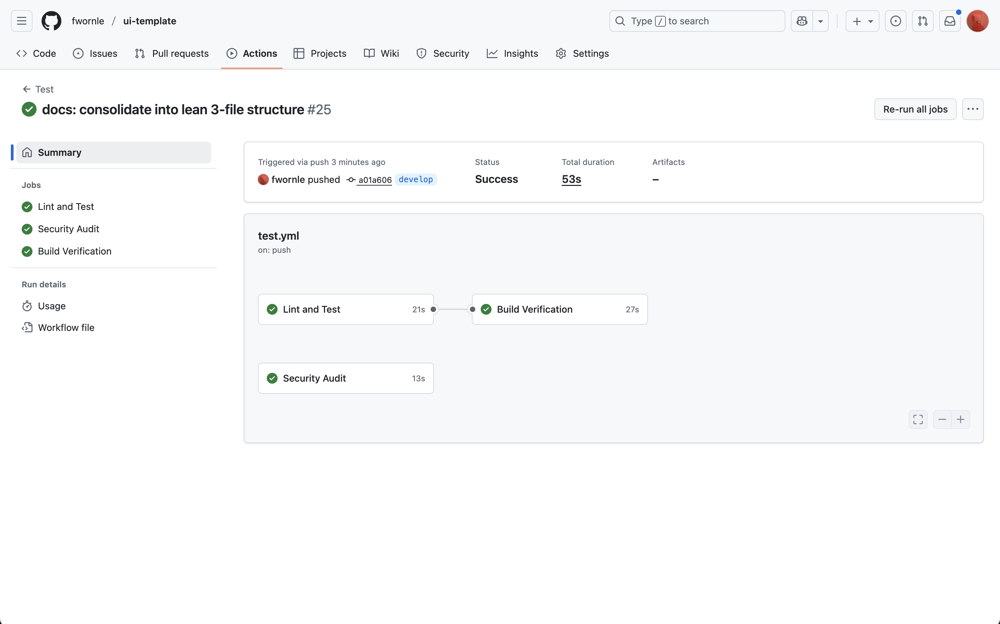
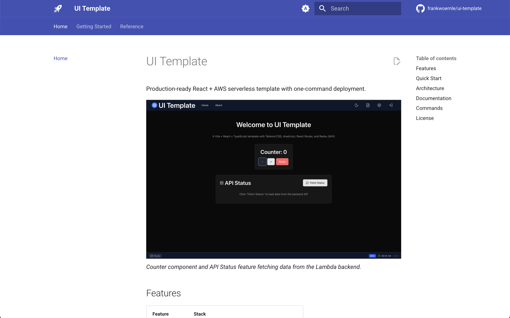

# Getting Started

From zero to production in three phases: **Setup** → **Deploy** → **Develop**.

## Prerequisites

| Tool | Version | Check |
|------|---------|-------|
| Node.js | 18+ | `node -v` |
| AWS CLI | 2.x | `aws --version` |
| AWS Account | - | [Create free account](https://aws.amazon.com/free/) |

---

## Phase 1: Setup

```bash
git clone <repository-url>
cd ui-template
npm install
```

**Configure AWS** (choose one):

=== "Personal Account (IAM)"
    ```bash
    aws configure
    # Enter: Access Key ID, Secret Key, region (eu-central-1)
    ```

=== "Corporate SSO"
    ```bash
    aws configure sso           # One-time setup
    aws sso login --profile your-profile
    export AWS_PROFILE=your-profile
    ```

---

## Phase 2: Deploy

```bash
npm run setup
```

This deploys your full stack to AWS:

| Resource | Purpose |
|----------|---------|
| CloudFront | CDN + HTTPS |
| S3 | Static hosting |
| Lambda | API backend |
| Cognito | Authentication |

**Output:**
```
✓ Complete
   webUrl: https://d1234567890.cloudfront.net
   apiUrl: https://xxx.lambda-url.eu-central-1.on.aws
```

---

## Phase 3: Develop

### Local Development (with AWS)

```bash
npm run dev
```

- Vite at `http://localhost:5173` with hot reload
- Lambda changes deploy instantly via SST
- Connected to real AWS resources

### Local-Only (no AWS)

```bash
npm run dev:local    # Frontend
npm run server       # Mock API (separate terminal)
```

---

## GitHub Actions Pipelines

The project includes **three automated workflows**:


*All workflows visible in the Actions tab: Deploy, Deploy Documentation, and Test.*

### Pipeline Overview

| Workflow | File | Purpose |
|----------|------|---------|
| **Deploy** | `deploy.yml` | Deploy app to AWS (dev/int/prod) |
| **Test** | `test.yml` | Lint, security audit, build verification |
| **Deploy Documentation** | `deploy-docs.yml` | Build MkDocs → GitHub Pages |

### App Deployment Pipeline


*Deploy workflow showing stage determination, SST deployment, smoke tests, and summary.*

| Trigger | Stage | Purpose |
|---------|-------|---------|
| Push to any branch (except `main`) | `dev` | Development testing |
| Push to `main` | `int` | Integration/staging |
| Tag `v*` | `prod` | Production release |


*Deployment history showing dev, int, and prod stages triggered by branch pushes and release tags.*

**Jobs:**

1. **Determine Deployment Stage** - Selects dev/int/prod based on trigger
2. **Deploy with SST** - Runs `npx sst deploy --stage <stage>`
3. **Smoke Tests** - Verifies deployment is accessible
4. **Deployment Summary** - Shows Web URL, API URL, stage

### Test Pipeline


*Test workflow runs on every push: lint, security audit, build verification.*

Runs on every push:

- **Lint and Test** - ESLint + TypeScript checks
- **Security Audit** - `npm audit` for vulnerabilities
- **Build Verification** - Production build succeeds

### Documentation Pipeline

Deploys MkDocs to GitHub Pages **only from `main` branch**:


*Live documentation at [fwornle.github.io/ui-template](https://fwornle.github.io/ui-template)*

| Trigger | Action |
|---------|--------|
| Push to `main` with `docs-content/**` changes | Build & deploy docs |
| Push to other branches | No docs deployment |

> **Note**: Documentation changes on feature branches won't appear on GitHub Pages until merged to `main`.

### Manual Deploy Commands

| Command | Stage |
|---------|-------|
| `npm run deploy` | Personal (your username) |
| `npm run deploy:dev` | Development |
| `npm run deploy:int` | Integration |
| `npm run deploy:prod` | Production |

### Release to Production

```bash
git checkout main
git tag v1.0.0
git push origin v1.0.0
```

---

## SST Console

Monitor deployments at [console.sst.dev](https://console.sst.dev):

1. Create account with work email
2. Add AWS account (deploy CloudFormation to **us-east-1**)
3. View real-time logs during `npm run dev`

---

## Troubleshooting

**AWS credentials not found:**
```bash
aws sts get-caller-identity  # Verify credentials
aws sso login --profile your-profile  # For SSO
```

**Deployment failed:**
```bash
npx sst unlock --stage dev   # Clear lock
npm run remove && npm run deploy  # Clean retry
```

**SST Console not showing app:**
Ensure CloudFormation stack is in **us-east-1** (required regardless of app region).

---

## Next Steps

- **[Reference Guide](reference.md)** - Architecture, SST config, API patterns
