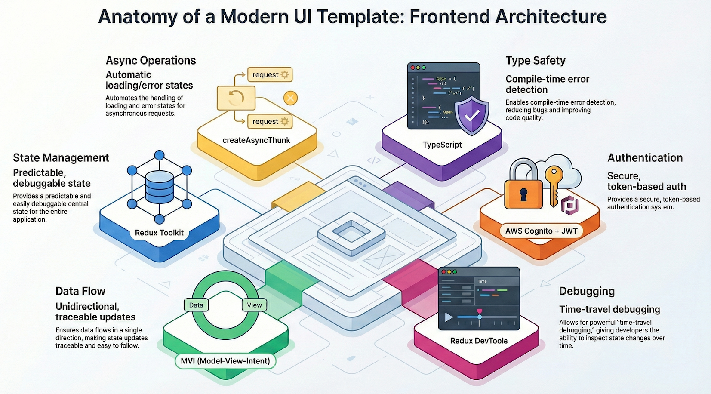
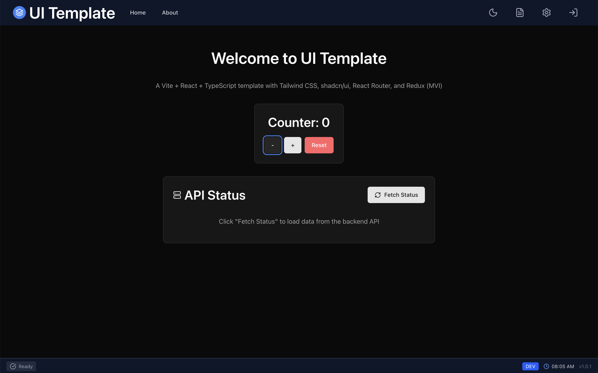
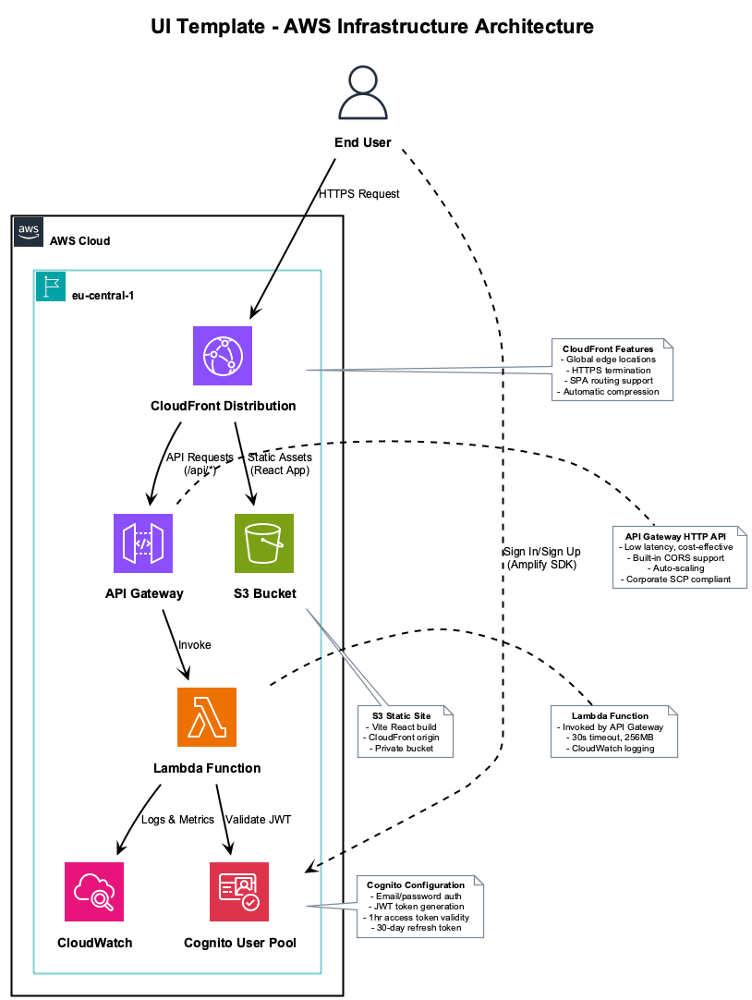
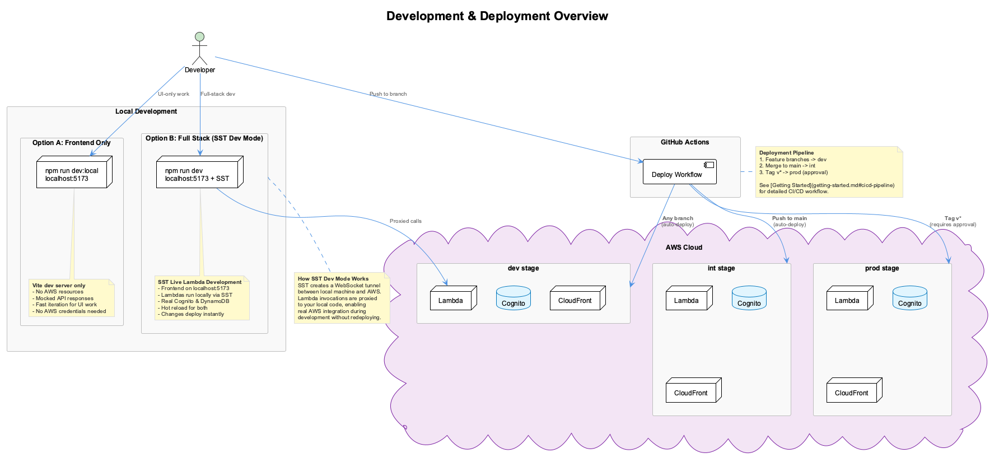
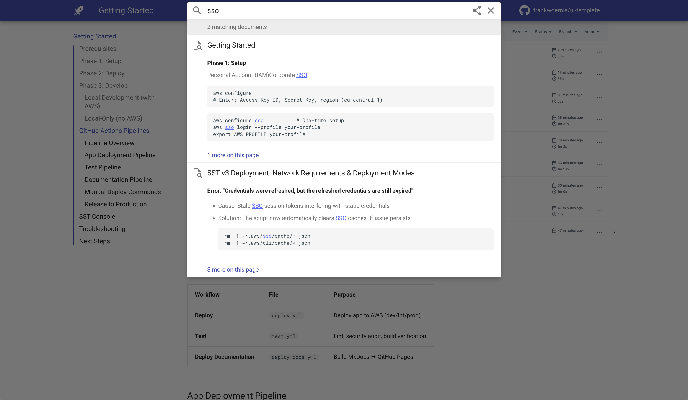

# UI Template

Production-ready React + AWS serverless template with one-command deployment.




*Counter component and API Status feature fetching data from the Lambda backend.*

## Features

| Feature | Stack |
|---------|-------|
| **Frontend** | React 19, TypeScript, Vite, Tailwind, Redux Toolkit |
| **Backend** | AWS Lambda with API Gateway |
| **Auth** | AWS Cognito with Amplify SDK |
| **Infrastructure** | SST v3 (Infrastructure as Code) |
| **CI/CD** | GitHub Actions (dev → int → prod) |

## Quick Start

```bash
git clone <repository-url>
cd ui-template
npm install
aws configure
npm run setup
```

**Done.** Your app is live on AWS.

## Architecture



| Component | Service |
|-----------|---------|
| CDN | CloudFront |
| Static Hosting | S3 |
| API | API Gateway + Lambda |
| Auth | Cognito User Pool |

## Development & Deployment



| Mode | Command | Description |
|------|---------|-------------|
| **Local (UI only)** | `npm run dev:local` | Frontend on localhost:5173, mocked backend |
| **Local (Full Stack)** | `npm run dev` | SST proxies Lambda calls to local code |
| **Dev** | Push any branch | Auto-deploys to dev stage |
| **Int** | Push to main | Auto-deploys to int stage |
| **Prod** | Tag `v*` | Requires approval, deploys to prod |

[SST Dev Mode](https://sst.dev/docs/live/) creates a WebSocket tunnel between your local machine and AWS, allowing Lambda invocations to run locally with real AWS resources.

See [Getting Started - CI/CD Pipeline](getting-started.md#cicd-pipeline) for detailed deployment workflow.

## Documentation

| Guide | Description |
|-------|-------------|
| **[Getting Started](getting-started.md)** | Setup, deploy, develop, CI/CD |
| **[Frontend Architecture](frontend-architecture.md)** | MVI pattern, Redux, auth, logging |
| **[Reference](reference.md)** | Architecture, SST config, API patterns |

Use the search bar (top of page) to find topics like SSO configuration or Corporate Network deployment:



## Commands

| Command | Purpose |
|---------|---------|
| `npm run dev` | Local dev with AWS |
| `npm run dev:local` | Local dev without AWS |
| `npm run deploy` | Deploy to personal stage |
| `npm run deploy:prod` | Deploy to production |

## License

[MIT](license.md)
