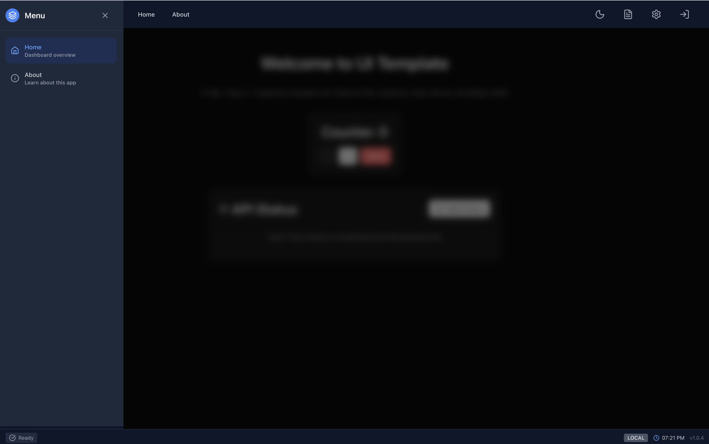
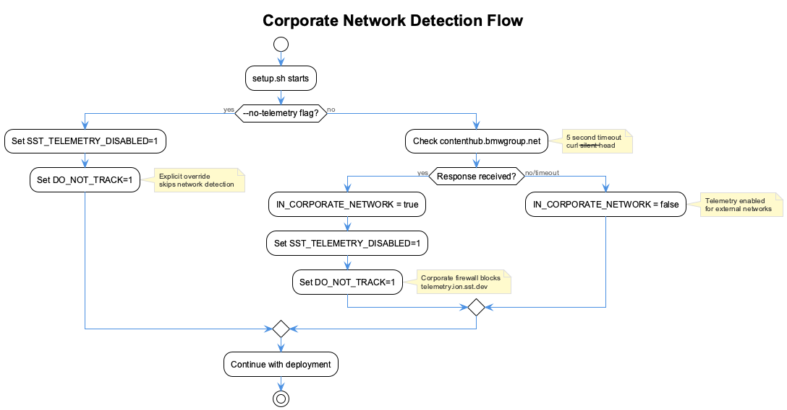
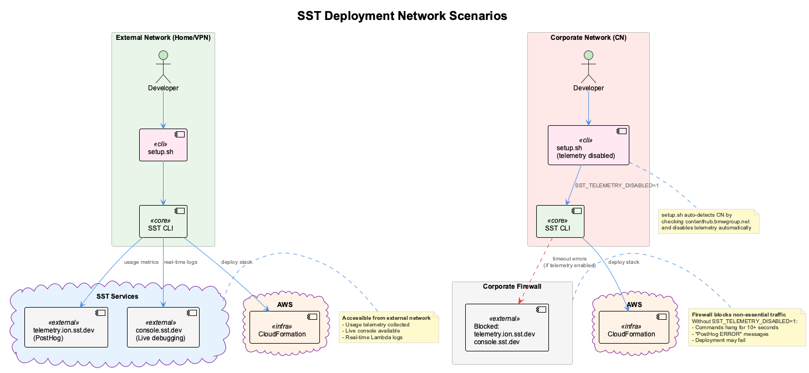

# Reference Guide

Technical reference for architecture, infrastructure, and development patterns.

---

## Architecture


| Component | Service | Purpose |
|-----------|---------|---------|
| CDN | CloudFront | Global edge caching, HTTPS, SPA routing |
| Storage | S3 | Static website hosting (private, OAI access) |
| API | API Gateway | HTTP API (v2) for routing |
| Compute | Lambda | API backend handler |
| Auth | Cognito | JWT-based authentication |
| Logs | CloudWatch | Monitoring and logging |

---

## SST Configuration

Infrastructure is defined in `sst.config.ts`:

```typescript
export default $config({
  app(input) {
    return {
      name: "ui-template",
      removal: input?.stage === "prod" ? "retain" : "remove",
      protect: input?.stage === "prod",
      home: "aws",
      providers: { aws: { region: "eu-central-1" } },
    };
  },
  async run() {
    // Resources defined here
  },
});
```

| Setting | Purpose |
|---------|---------|
| `removal: retain` | Keep prod resources on delete |
| `protect: true` | Prevent accidental prod deletion |

### Cognito User Pool

```typescript
const userPool = new sst.aws.CognitoUserPool("Auth", {
  usernames: ["email"],
  transform: {
    userPool: {
      passwordPolicy: {
        minimumLength: 8,
        requireLowercase: true,
        requireUppercase: true,
        requireNumbers: true,
      },
    },
  },
});
```

| Token | Validity |
|-------|----------|
| Access | 1 hour |
| ID | 1 hour |
| Refresh | 30 days |

### API Gateway + Lambda

```typescript
// API Gateway HTTP API (using API Gateway instead of Lambda Function URLs
// because corporate SCPs may block lambda:CreateFunctionUrlConfig)
const api = new sst.aws.ApiGatewayV2("Api", {
  cors: {
    allowOrigins: ["*"],
    allowMethods: ["*"],
    allowHeaders: ["*"],
    allowCredentials: false,
  },
});

api.route("$default", {
  handler: "lambda/api/index.handler",
  timeout: "30 seconds",
  memory: "256 MB",
  environment: {
    // ... environment variables
  },
});
```

> **CORS**: Configured in SST API Gateway, not Lambda code. Never add CORS headers in your handler.

### Static Site

```typescript
const web = new sst.aws.StaticSite("Web", {
  build: { command: "npm run build", output: "dist" },
  environment: {
    VITE_API_URL: api.url,
    VITE_COGNITO_USER_POOL_ID: userPool.id,
    VITE_ENVIRONMENT: $app.stage,
  },
});
```

Environment variables prefixed with `VITE_` are embedded at build time.

---

## Project Structure

| Directory | Purpose | Key Files |
|-----------|---------|-----------|
| `src/components/auth/` | Authentication UI | LoginModal, AuthDialog |
| `src/components/layout/` | Layout components | TopBar, BottomBar, SidebarMenu |
| `src/components/settings/` | Settings UI | SettingsModal |
| `src/components/ui/` | Reusable components | LoggingControl |
| `src/features/` | Feature slices | api-status, counter |
| `src/hooks/` | Custom hooks | useAuth, useAppDispatch |
| `src/services/` | API services | apiClient, cognitoService |
| `src/store/` | Redux store | index.ts + slices/ |
| `src/store/slices/` | Redux slices | authSlice, preferencesSlice, sidebarSlice |
| `src/utils/logging/` | Logger system | Logger, config |
| `src/pages/` | Page components | HomePage, AboutPage |
| `lambda/api/` | Backend | Lambda handler |
| `sst.config.ts` | Infrastructure | SST configuration |

---

## Authentication

### Usage

```typescript
import { useAuth } from '@/hooks/useAuth';

function MyComponent() {
  const { user, isAuthenticated, login, signOut } = useAuth();

  if (isAuthenticated) {
    return <div>Welcome, {user.name}</div>;
  }
  return <button onClick={() => login({ username, password })}>Sign In</button>;
}
```

### Flow

1. User submits credentials → Cognito validates via SRP
2. JWT tokens returned (access, ID, refresh)
3. Tokens stored in Redux + localStorage
4. apiClient auto-attaches token to requests

---

## API Client

```typescript
import { api } from '@/services/apiClient';

// Public endpoints
const health = await api.public.health();

// Protected endpoints (auto-attaches token)
const profile = await api.user.getProfile();

// Generic requests
const data = await api.get<MyType>('/api/custom');
```

### Error Handling

```typescript
import { ApiError } from '@/services/apiClient';

try {
  await api.get('/api/protected');
} catch (error) {
  if (error instanceof ApiError) {
    console.log(error.status, error.message);
  }
}
```

---

## Logger

The Logger provides colored, categorized console output for debugging.

### Console Output

**INFO level** - User interactions and key events:


*Console showing INFO logs from Counter and API Status interactions*

**All levels enabled** - Complete application trace:


*Console showing WARN, DEBUG, TRACE, and INFO logs*

### Usage

```typescript
import { Logger } from '@/utils/logging';

Logger.error(Logger.Categories.AUTH, 'Auth failed:', error);
Logger.warn(Logger.Categories.API, 'Retry:', attempt);
Logger.info(Logger.Categories.APP, 'Started');
Logger.debug(Logger.Categories.STORE, 'State:', newState);
Logger.trace(Logger.Categories.UI, 'Component rendered');
```

| Level | Console Method | When to Use |
|-------|----------------|-------------|
| ERROR | `console.error` | Critical failures |
| WARN | `console.warn` | Potential issues |
| INFO | `console.info` | Key user events |
| DEBUG | `console.debug` | Detailed data |
| TRACE | `console.log` | Verbose tracing |

| Category | Color | Purpose |
|----------|-------|---------|
| APP | Gray | General application |
| AUTH | Pink | Authentication |
| API | Indigo | HTTP requests |
| STORE | Teal | Redux state |
| UI | Blue | Components |

### Configuration

Configure via Settings modal:


*Settings modal with Log Levels and Categories toggles*

Or programmatically:
```typescript
Logger.setActiveLevels(new Set(['ERROR', 'WARN', 'INFO']));
Logger.setActiveCategories(new Set(['AUTH', 'API']));
```

---

## State Management

```typescript
import { useAppDispatch, useAppSelector } from '@/store';

function MyComponent() {
  const dispatch = useAppDispatch();
  const theme = useAppSelector(state => state.preferences.theme);

  dispatch(setTheme('dark'));
}
```

### Store Shape

| Slice | State Properties |
|-------|------------------|
| `auth` | `user`, `tokens`, `isAuthenticated`, `isLoading`, `error` |
| `preferences` | `theme` |
| `logging` | `activeLevels`, `activeCategories` |
| `apiStatus` | `health`, `version`, `config`, `loading`, `error` |
| `sidebar` | `isOpen` |

### Sidebar Menu

The sidebar provides quick navigation and is controlled via Redux state:


*Slide-out sidebar menu with navigation items*

**Interaction:**

| Trigger | Action |
|---------|--------|
| Mouse near left edge | Opens sidebar automatically |
| Click outside (backdrop) | Closes sidebar |
| Press ESC key | Closes sidebar |
| Navigate to page | Closes sidebar |

**Redux Actions:**

| Action | Purpose |
|--------|---------|
| `openSidebar` | Open the sidebar menu |
| `closeSidebar` | Close the sidebar menu |
| `toggleSidebar` | Toggle sidebar open/closed |
| `setSidebarOpen(boolean)` | Set sidebar state explicitly |

Usage:
```typescript
import { useAppDispatch, useAppSelector } from '@/store';
import { openSidebar, closeSidebar } from '@/store/slices/sidebarSlice';

// Check if sidebar is open
const isOpen = useAppSelector(state => state.sidebar.isOpen);

// Programmatically control sidebar
dispatch(openSidebar());
dispatch(closeSidebar());
```

---

## Theming

Three modes: `light`, `dark`, `system`

```typescript
import { setTheme } from '@/store/slices/preferencesSlice';
dispatch(setTheme('dark'));
```

CSS variables in `src/index.css`:
```css
:root { --background: 0 0% 100%; }
.dark { --background: 222.2 84% 4.9%; }
```

---

## Adding Resources

**Example: DynamoDB Table**

```typescript
// In sst.config.ts run()
const table = new sst.aws.Dynamo("Users", {
  fields: { userId: "string" },
  primaryIndex: { hashKey: "userId" },
});

const api = new sst.aws.Function("Api", {
  link: [table],  // Makes table accessible in Lambda
  // ...
});
```

### SST Resources

| Resource | Class |
|----------|-------|
| Lambda | `sst.aws.Function` |
| Static Site | `sst.aws.StaticSite` |
| Cognito | `sst.aws.CognitoUserPool` |
| DynamoDB | `sst.aws.Dynamo` |
| S3 | `sst.aws.Bucket` |

[SST Documentation](https://sst.dev/docs/)

---

## Environment Variables

### Build-time (Vite)

| Variable | Description |
|----------|-------------|
| `VITE_API_URL` | API Gateway URL |
| `VITE_COGNITO_USER_POOL_ID` | Cognito Pool ID |
| `VITE_COGNITO_USER_POOL_CLIENT_ID` | Cognito Client ID |
| `VITE_ENVIRONMENT` | Stage name |

### Runtime (Lambda)

| Variable | Description |
|----------|-------------|
| `NODE_ENV` | Stage name |
| `LOG_LEVEL` | `debug` or `warn` |
| `USER_POOL_ID` | Cognito Pool ID |

---

## Setup Script Reference

The `scripts/setup.sh` script handles AWS authentication, network detection, and SST deployment.

### Command Line Options

| Option | Description |
|--------|-------------|
| `--stage <name>` | Deploy to specific stage (dev, int, prod, or custom) |
| `--profile <name>` | Use specific AWS profile |
| `--check` | Check AWS credentials only (no deployment) |
| `--unlock` | Unlock SST state (with telemetry disabled for corporate networks) |
| `--skip-install` | Skip npm install check (faster when deps already installed) |
| `--non-interactive` | Run without prompts (for CI/CD, containers) |
| `--no-telemetry` | Force disable SST telemetry |
| `--verbose` | Enable verbose logging |
| `--timeout <seconds>` | Set timeout for operations (default: 300) |
| `--help` | Show help message |

### Usage Examples

```bash
# Interactive setup and deploy
./scripts/setup.sh

# Deploy to dev stage
./scripts/setup.sh --stage dev

# Deploy with specific AWS profile
./scripts/setup.sh --profile raas-dev --stage dev

# Check AWS credentials only
./scripts/setup.sh --check

# Unlock SST state safely (when deployment is locked)
./scripts/setup.sh --unlock

# CI/CD mode (no prompts)
./scripts/setup.sh --non-interactive --stage dev
```

---

## Corporate Network Detection

When deploying from corporate networks, certain external endpoints are blocked by firewalls. The setup script automatically detects this and adapts.

### How It Works



1. **Detection**: Script checks if `contenthub.bmwgroup.net` is accessible (5s timeout)
2. **If accessible**: Corporate network detected, telemetry disabled
3. **If not accessible**: External network, telemetry remains enabled

### Network Scenarios



### What Gets Disabled in Corporate Network

| Service | URL | Purpose | Impact When Blocked |
|---------|-----|---------|---------------------|
| **Telemetry** | telemetry.ion.sst.dev | Usage metrics to PostHog | 10s+ timeout per command |
| **Console** | console.sst.dev | Live debugging, Lambda logs | No real-time monitoring |

### Environment Variables Set

When corporate network is detected (or `--no-telemetry` is used):

```bash
SST_TELEMETRY_DISABLED=1  # Prevents SST from sending telemetry
DO_NOT_TRACK=1            # Standard do-not-track signal
```

### Troubleshooting: SST Lock Issues

If deployment shows `Locked: A concurrent update was detected`, use the unlock option:

```bash
# Safe unlock with telemetry protection
./scripts/setup.sh --unlock

# With specific AWS profile
./scripts/setup.sh --unlock --profile raas-dev
```

**Why not use `sst unlock` directly?**

Running `sst unlock` directly from the command line doesn't have the telemetry protection. In corporate networks:

```bash
# This will hang with PostHog errors:
sst unlock
# posthog ERROR: sending request - context deadline exceeded

# Use this instead (telemetry automatically disabled):
./scripts/setup.sh --unlock
```

### SST Console Limitations in Corporate Networks

The SST Console (`console.sst.dev`) provides:

- Real-time Lambda invocation logs
- Resource monitoring
- Live debugging during `npm run dev`

**In corporate networks**, console.sst.dev is blocked, so:

- Use CloudWatch Logs for Lambda debugging
- Check `.sst/log/sst.log` for local SST logs
- Use `--verbose` flag for more local output

---

## Security

- All traffic TLS 1.2+
- S3 bucket private (CloudFront OAI only)
- SRP authentication (password never transmitted)
- JWT signature verification
- Token expiration enforced

---

## Cost (Free Tier)

| Service | Free Tier |
|---------|-----------|
| Lambda | 1M requests/month |
| CloudFront | 1TB transfer |
| S3 | 5GB storage |
| Cognito | 50,000 MAU |
