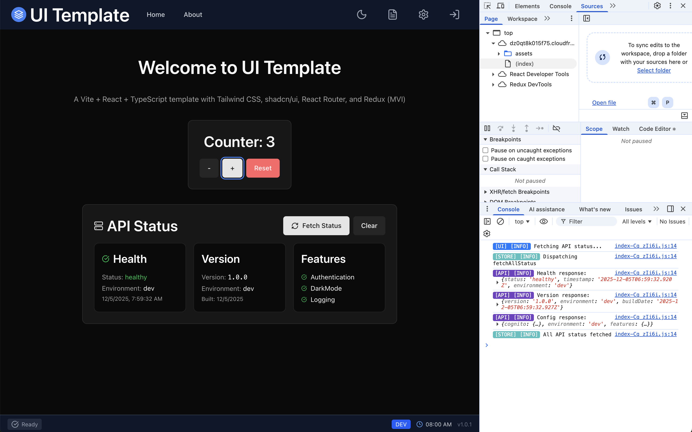

# Reference Guide

Technical reference for architecture, infrastructure, and development patterns.

---

## Architecture


| Component | Service | Purpose |
|-----------|---------|---------|
| CDN | CloudFront | Global edge caching, HTTPS, SPA routing |
| Storage | S3 | Static website hosting (private, OAI access) |
| Compute | Lambda | API backend with Function URL |
| Auth | Cognito | JWT-based authentication |
| Logs | CloudWatch | Monitoring and logging |

---

## SST Configuration

Infrastructure is defined in `sst.config.ts`:

```typescript
export default $config({
  app(input) {
    return {
      name: "ui-template",
      removal: input?.stage === "prod" ? "retain" : "remove",
      protect: input?.stage === "prod",
      home: "aws",
      providers: { aws: { region: "eu-central-1" } },
    };
  },
  async run() {
    // Resources defined here
  },
});
```

| Setting | Purpose |
|---------|---------|
| `removal: retain` | Keep prod resources on delete |
| `protect: true` | Prevent accidental prod deletion |

### Cognito User Pool

```typescript
const userPool = new sst.aws.CognitoUserPool("Auth", {
  usernames: ["email"],
  transform: {
    userPool: {
      passwordPolicy: {
        minimumLength: 8,
        requireLowercase: true,
        requireUppercase: true,
        requireNumbers: true,
      },
    },
  },
});
```

| Token | Validity |
|-------|----------|
| Access | 1 hour |
| ID | 1 hour |
| Refresh | 30 days |

### Lambda Function

```typescript
const api = new sst.aws.Function("Api", {
  handler: "lambda/api/index.handler",
  timeout: "30 seconds",
  memory: "256 MB",
  url: {
    cors: { allowOrigins: ["*"], allowMethods: ["*"], allowHeaders: ["*"] },
  },
});
```

> **CORS**: Configured in SST, not Lambda code. Never add CORS headers in your handler.

### Static Site

```typescript
const web = new sst.aws.StaticSite("Web", {
  build: { command: "npm run build", output: "dist" },
  environment: {
    VITE_API_URL: api.url,
    VITE_COGNITO_USER_POOL_ID: userPool.id,
    VITE_ENVIRONMENT: $app.stage,
  },
});
```

Environment variables prefixed with `VITE_` are embedded at build time.

---

## Project Structure

```
ui-template/
├── src/
│   ├── components/        # UI components
│   │   ├── auth/          # LoginModal
│   │   ├── layout/        # TopBar, BottomBar
│   │   ├── settings/      # Settings modal
│   │   └── ui/            # Reusable components
│   ├── features/          # Feature slices (api-status)
│   ├── hooks/             # useAuth, useAppDispatch
│   ├── services/          # apiClient, cognitoService
│   ├── store/             # Redux store + slices
│   ├── utils/logging/     # Logger system
│   └── pages/             # Page components
├── lambda/api/            # Lambda handler
└── sst.config.ts          # Infrastructure
```

---

## Authentication

### Usage

```typescript
import { useAuth } from '@/hooks/useAuth';

function MyComponent() {
  const { user, isAuthenticated, login, signOut } = useAuth();

  if (isAuthenticated) {
    return <div>Welcome, {user.name}</div>;
  }
  return <button onClick={() => login({ username, password })}>Sign In</button>;
}
```

### Flow

1. User submits credentials → Cognito validates via SRP
2. JWT tokens returned (access, ID, refresh)
3. Tokens stored in Redux + localStorage
4. apiClient auto-attaches token to requests

---

## API Client

```typescript
import { api } from '@/services/apiClient';

// Public endpoints
const health = await api.public.health();

// Protected endpoints (auto-attaches token)
const profile = await api.user.getProfile();

// Generic requests
const data = await api.get<MyType>('/api/custom');
```

### Error Handling

```typescript
import { ApiError } from '@/services/apiClient';

try {
  await api.get('/api/protected');
} catch (error) {
  if (error instanceof ApiError) {
    console.log(error.status, error.message);
  }
}
```

---

## Logger


*Colored log output organized by category.*

```typescript
import { Logger } from '@/utils/logging';

Logger.error(Logger.Categories.AUTH, 'Auth failed:', error);
Logger.warn(Logger.Categories.API, 'Retry:', attempt);
Logger.info(Logger.Categories.APP, 'Started');
Logger.debug(Logger.Categories.STORE, 'State:', newState);
```

| Level | Console Method |
|-------|----------------|
| ERROR | `console.error` |
| WARN | `console.warn` |
| INFO | `console.info` |
| DEBUG | `console.debug` |
| TRACE | `console.log` |

| Category | Color | Purpose |
|----------|-------|---------|
| APP | Gray | General application |
| AUTH | Pink | Authentication |
| API | Indigo | HTTP requests |
| STORE | Teal | Redux state |
| UI | Blue | Components |

Configure via Settings modal or programmatically:
```typescript
Logger.setActiveLevels(new Set(['ERROR', 'WARN', 'INFO']));
Logger.setActiveCategories(new Set(['AUTH', 'API']));
```

---

## State Management

```typescript
import { useAppDispatch, useAppSelector } from '@/store';

function MyComponent() {
  const dispatch = useAppDispatch();
  const theme = useAppSelector(state => state.preferences.theme);

  dispatch(setTheme('dark'));
}
```

### Store Shape

```typescript
{
  auth: { user, tokens, isAuthenticated, isLoading, error },
  preferences: { theme },
  logging: { activeLevels, activeCategories },
  apiStatus: { health, version, config, loading, error },
}
```

---

## Theming

Three modes: `light`, `dark`, `system`

```typescript
import { setTheme } from '@/store/slices/preferencesSlice';
dispatch(setTheme('dark'));
```

CSS variables in `src/index.css`:
```css
:root { --background: 0 0% 100%; }
.dark { --background: 222.2 84% 4.9%; }
```

---

## Adding Resources

**Example: DynamoDB Table**

```typescript
// In sst.config.ts run()
const table = new sst.aws.Dynamo("Users", {
  fields: { userId: "string" },
  primaryIndex: { hashKey: "userId" },
});

const api = new sst.aws.Function("Api", {
  link: [table],  // Makes table accessible in Lambda
  // ...
});
```

### SST Resources

| Resource | Class |
|----------|-------|
| Lambda | `sst.aws.Function` |
| Static Site | `sst.aws.StaticSite` |
| Cognito | `sst.aws.CognitoUserPool` |
| DynamoDB | `sst.aws.Dynamo` |
| S3 | `sst.aws.Bucket` |

[SST Documentation](https://sst.dev/docs/)

---

## Environment Variables

### Build-time (Vite)

| Variable | Description |
|----------|-------------|
| `VITE_API_URL` | Lambda Function URL |
| `VITE_COGNITO_USER_POOL_ID` | Cognito Pool ID |
| `VITE_COGNITO_USER_POOL_CLIENT_ID` | Cognito Client ID |
| `VITE_ENVIRONMENT` | Stage name |

### Runtime (Lambda)

| Variable | Description |
|----------|-------------|
| `NODE_ENV` | Stage name |
| `LOG_LEVEL` | `debug` or `warn` |
| `USER_POOL_ID` | Cognito Pool ID |

---

## Security

- All traffic TLS 1.2+
- S3 bucket private (CloudFront OAI only)
- SRP authentication (password never transmitted)
- JWT signature verification
- Token expiration enforced

---

## Cost (Free Tier)

| Service | Free Tier |
|---------|-----------|
| Lambda | 1M requests/month |
| CloudFront | 1TB transfer |
| S3 | 5GB storage |
| Cognito | 50,000 MAU |
