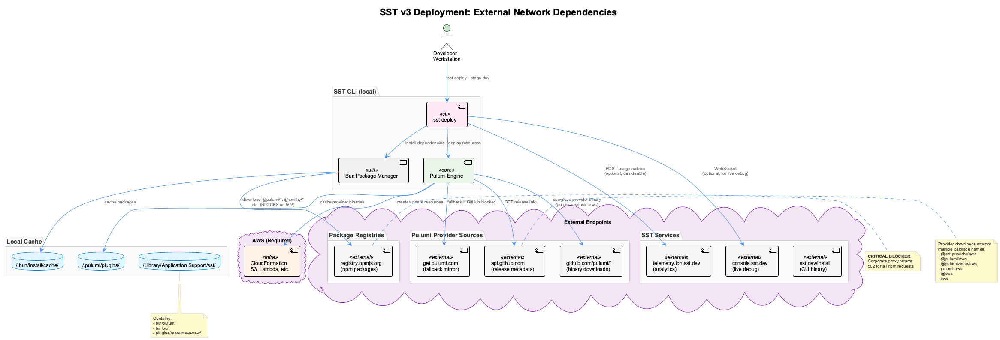

# SST v3 Deployment: Network Requirements & Deployment Modes

This document details the external network dependencies required during SST v3 deployment and strategies for deploying in different network environments.

## Architecture Overview



## Network Modes

The setup script automatically detects and configures for three network modes:

| Mode | Detection | Network Access | Configuration |
|------|-----------|----------------|---------------|
| **EXTERNAL** | contenthub returns non-200 (e.g., 307 redirect) | Full internet | Normal deployment, proxy cleared |
| **CN_PROXY** | contenthub returns 200 + proxy env vars | Via corporate proxy | Auto-configures npm proxy |
| **CN_AIRGAP** | contenthub returns 200 + no npm access | None (AWS only) | Requires deployment cache |

### Detection Flow

The network detection follows this logic:

1. **Check for forced external mode** - If `FORCE_EXTERNAL_NETWORK=1` is set, skip detection and use EXTERNAL mode
2. **Check corporate network** - Test if `contenthub.bmwgroup.net` returns HTTP 200 (5s timeout)
   - HTTP 200 = Inside corporate network (actual content served)
   - HTTP 307/302 = Outside corporate network (redirect to login page)
   - Timeout/error = Outside corporate network
3. **If in corporate network (HTTP 200):**
   - Check if `HTTP_PROXY` or `HTTPS_PROXY` environment variables are set
   - If proxy is set: **CN_PROXY** mode (deploy via proxy)
   - If no proxy: Test if `registry.npmjs.org` is accessible
     - If npm accessible: **CN_PROXY** mode (direct access works)
     - If npm blocked: **CN_AIRGAP** mode (requires deployment cache)
   - SST telemetry is always disabled in corporate network
4. **If outside corporate network (non-200 response):** **EXTERNAL** mode
   - Any proxy environment variables are **automatically cleared** to prevent interference
   - Full internet access assumed

### Override Options

| Variable | Purpose | Usage |
|----------|---------|-------|
| `FORCE_EXTERNAL_NETWORK=1` | Force EXTERNAL mode regardless of detection | Useful when VPN causes false CN detection |

## AWS Authentication

The setup script handles AWS authentication robustly across different credential sources.

### Supported Authentication Methods

1. **AWS Profile (Recommended)** - Set via `AWS_PROFILE` environment variable
2. **AWS SSO** - Interactive login when SSO session expires
3. **IAM User Credentials** - Static access key/secret (prompted if needed)

### Automatic Credential Cleanup

The script automatically cleans up stale credentials that can interfere with authentication:

| Issue | Automatic Fix |
|-------|---------------|
| Stale SSO cache in `~/.aws/sso/cache/` | Cleared when using static credential profiles |
| Stale CLI cache in `~/.aws/cli/cache/` | Cleared when using static credential profiles |
| `AWS_SESSION_TOKEN` env var | Unset when using profile-based auth |
| `AWS_ACCESS_KEY_ID`/`AWS_SECRET_ACCESS_KEY` env vars | Unset when profile is specified (profile takes precedence) |

### Using AWS Profiles

The script respects the `AWS_PROFILE` environment variable. You can set it directly or create shell aliases for convenience:

```bash
# Option 1: Set profile directly
export AWS_PROFILE=my-profile
./scripts/setup.sh --stage dev

# Option 2: Use --profile flag
./scripts/setup.sh --stage dev --profile my-profile

# Option 3: Create a shell alias (add to ~/.zshrc or ~/.bashrc)
alias aws-myprofile="export AWS_PROFILE=my-profile && echo 'Switched to my-profile'"
```

The script will automatically:
1. Detect the `AWS_PROFILE` environment variable
2. Clear any conflicting environment variables or caches
3. Use the profile's credentials directly

## External Endpoints Required

### 1. SST Services (Optional - Auto-disabled in CN)

| Endpoint | Purpose | Required? | Can Disable? |
|----------|---------|-----------|--------------|
| `telemetry.ion.sst.dev` | Anonymous usage analytics | No | Yes: `SST_TELEMETRY_DISABLED=1` |
| `console.sst.dev` | Live debugging WebSocket | No | Yes: Don't use `sst dev` |
| `sst.dev/install` | CLI binary download | First install only | Pre-install binary |

### 2. Package Registries (Critical for EXTERNAL/CN_PROXY)

| Endpoint | Purpose | Required? | Alternative |
|----------|---------|-----------|-------------|
| `registry.npmjs.org` | npm packages (@pulumi/*, @smithy/*, etc.) | Yes | Internal npm mirror or cache |

**Packages downloaded during deployment:**
- `@pulumi/pulumi` - Core Pulumi SDK
- `@pulumi/aws` - AWS provider bindings
- `@smithy/*` - AWS SDK components
- `esbuild` - Build tooling
- Various SST internal dependencies

### 3. Pulumi Provider Sources (Critical for EXTERNAL/CN_PROXY)

| Endpoint | Purpose | Required? | Alternative |
|----------|---------|-----------|-------------|
| `api.github.com` | Release metadata lookup | Yes | Override with env var |
| `github.com/pulumi/*` | Provider binary downloads | Yes | Override with env var |
| `get.pulumi.com` | Fallback mirror | Fallback | Override with env var |

**Provider binaries downloaded:**
- `pulumi-resource-aws` (~200MB) - AWS provider
- Other providers as needed (cloudflare, etc.)

### 4. AWS Endpoints (Required in all modes)

| Endpoint | Purpose | Required? |
|----------|---------|-----------|
| AWS regional endpoints | CloudFormation, S3, Lambda, IAM, etc. | Yes |

## Deployment by Network Mode

### Mode 1: EXTERNAL (Outside Corporate Network)

**Detection:** `contenthub.bmwgroup.net` returns non-200 (e.g., 307 redirect)

**Command:**
```bash
# Using AWS profile (recommended)
export AWS_PROFILE=your-profile
./scripts/setup.sh --stage dev

# Or use --profile flag
./scripts/setup.sh --stage dev --profile my-profile
```

**What happens:**
- Full internet access to npm, GitHub, SST services
- Any proxy environment variables are **automatically cleared**
- SST telemetry enabled (optional)
- Normal deployment flow

**Important:** In EXTERNAL mode, the script unsets `HTTP_PROXY`, `HTTPS_PROXY`, `http_proxy`, and `https_proxy` to prevent local proxies from interfering with AWS CLI calls.

### Mode 2: CN_PROXY (Corporate Network with Proxy)

**Detection:** `contenthub.bmwgroup.net` returns HTTP 200 AND (`HTTP_PROXY` set OR npm registry accessible)

**Command:**
```bash
# Option A: Set proxy environment variables
HTTP_PROXY=http://proxy.company.com:8080 \
HTTPS_PROXY=http://proxy.company.com:8080 \
./scripts/setup.sh --stage dev

# Option B: Export before running
export HTTP_PROXY=http://proxy.company.com:8080
export HTTPS_PROXY=http://proxy.company.com:8080
./scripts/setup.sh --stage dev
```

**What happens:**
- SST telemetry auto-disabled
- npm configured to use proxy
- NO_PROXY auto-configured for AWS endpoints
- Deployment proceeds via proxy

**Proxy Configuration (automatic):**
```bash
# These are set automatically by setup.sh:
npm config set proxy $HTTP_PROXY
npm config set https-proxy $HTTPS_PROXY
NO_PROXY=.amazonaws.com,.aws.amazon.com,169.254.169.254,localhost,127.0.0.1
```

### Mode 3: CN_AIRGAP (Corporate Network, No External Access)

**Detection:** `contenthub.bmwgroup.net` returns HTTP 200 AND no proxy AND npm registry unreachable

**Prerequisites:** Deployment cache with node_modules

**Setup (run once from EXTERNAL network):**
```bash
# 1. Deploy successfully to populate caches
./scripts/setup.sh --stage dev

# 2. Create deployment cache with node_modules
./scripts/create-deployment-cache.sh --include-node-modules

# 3. Transfer to air-gapped machine (choose one):
# Option A: Commit to repository
git add .deployment-cache
git commit -m 'Add deployment cache for offline use'
git push

# Option B: Create tarball
tar -czf deployment-cache.tar.gz .deployment-cache
# Transfer file to restricted machine
# On restricted machine: tar -xzf deployment-cache.tar.gz
```

**Command (in air-gapped environment):**
```bash
./scripts/setup.sh --stage dev
```

**What happens:**
- Script detects air-gapped mode
- Restores node_modules from cache
- Restores Pulumi plugins from cache
- Skips npm install
- Deploys using cached assets

## Local Cache Locations

SST and Pulumi cache downloaded assets locally:

| Location | Contents |
|----------|----------|
| `~/.pulumi/plugins/` | Pulumi provider binaries |
| `~/.bun/install/cache/` | Bun/npm package cache |
| `~/Library/Application Support/sst/` | SST binaries and plugins (macOS) |
| `~/.aws/sso/cache/` | AWS SSO session tokens |
| `~/.aws/cli/cache/` | AWS CLI credential cache |

The SST directory contains:
- `bin/pulumi` - Pulumi CLI
- `bin/bun` - Bun package manager
- `plugins/resource-aws-v*` - AWS provider

## Deployment Cache Structure

Created by `./scripts/create-deployment-cache.sh --include-node-modules`:

| Path | Contents |
|------|----------|
| `.deployment-cache/manifest.json` | Cache metadata |
| `.deployment-cache/pulumi-plugins/` | Pulumi provider binaries (~200MB) |
| `.deployment-cache/sst-binaries/` | SST/Pulumi/Bun binaries |
| `.deployment-cache/node_modules/` | npm packages (if --include-node-modules) |

## Environment Variables Reference

| Variable | Purpose | Example |
|----------|---------|---------|
| `AWS_PROFILE` | AWS profile to use | `my-profile`, `dev` |
| `FORCE_EXTERNAL_NETWORK=1` | Force EXTERNAL mode | Bypass CN detection |
| `SST_TELEMETRY_DISABLED=1` | Disable telemetry calls | Auto-set in CN |
| `PULUMI_SKIP_UPDATE_CHECK=true` | Skip version check | Auto-set with cache |
| `DO_NOT_TRACK=1` | Standard DNT signal | Auto-set in CN |
| `HTTP_PROXY` | HTTP proxy URL | `http://proxy:8080` |
| `HTTPS_PROXY` | HTTPS proxy URL | `http://proxy:8080` |
| `NO_PROXY` | Bypass proxy for these domains | Auto-configured for AWS |

## Quick Reference: Which Mode Am I In?

Run setup.sh and look for the network mode message:

```bash
./scripts/setup.sh --check

# Output examples:
# Network mode: EXTERNAL (full internet access)
# Network mode: CN_PROXY (corporate with proxy)
# Network mode: CN_AIRGAP (no external network)
```

## Troubleshooting

### Error: "Credentials were refreshed, but the refreshed credentials are still expired"
- **Cause:** Stale SSO session tokens interfering with static credentials
- **Solution:** The script now automatically clears SSO caches. If issue persists:
  ```bash
  rm -f ~/.aws/sso/cache/*.json
  rm -f ~/.aws/cli/cache/*.json
  ```

### Error: "Air-gapped mode requires .deployment-cache/"
- **Cause:** No proxy, no npm access, and no cache
- **Solution:** Create cache from unrestricted network:
  ```bash
  ./scripts/create-deployment-cache.sh --include-node-modules
  ```

### Error: "provider aws not found"
- **Cause:** Pulumi can't download AWS provider binary
- **Solution:**
  - CN_PROXY: Check proxy settings
  - CN_AIRGAP: Ensure cache includes Pulumi plugins

### Error: 502 from registry.npmjs.org
- **Cause:** Corporate proxy blocking/failing npm requests
- **Solution:**
  - CN_PROXY: Verify HTTP_PROXY is correct
  - CN_AIRGAP: Use deployment cache with node_modules

### Error: Timeout connecting to telemetry.ion.sst.dev
- **Cause:** SST telemetry endpoint unreachable
- **Solution:** Should auto-disable in CN; if not, use `--no-telemetry`

### False CN detection (detected as CN when outside)
- **Cause:** VPN or network config makes contenthub accessible
- **Solution:** Force external mode:
  ```bash
  FORCE_EXTERNAL_NETWORK=1 ./scripts/setup.sh --stage dev
  ```

### Proxy interfering with AWS calls in EXTERNAL mode
- **Cause:** Local proxy (e.g., Charles, Fiddler) set in environment
- **Solution:** Script now auto-clears proxy vars in EXTERNAL mode. If issue persists:
  ```bash
  unset HTTP_PROXY HTTPS_PROXY http_proxy https_proxy
  ./scripts/setup.sh --stage dev
  ```

### AWS profile not being used
- **Cause:** Environment variables overriding profile credentials
- **Solution:** Script now auto-clears conflicting env vars. Ensure your alias exports AWS_PROFILE:
  ```bash
  # Good alias definition
  alias aws-myprofile="export AWS_PROFILE=my-profile && echo 'Switched to my-profile'"
  ```

## Complete Deployment Scenarios

### Scenario 1: Home Office with AWS Profile
```bash
cd ui-template
export AWS_PROFILE=my-profile  # Or use --profile flag
./scripts/setup.sh --stage dev
# Deploys with full internet access using specified profile
```

### Scenario 2: Home Office with Local Proxy Running
```bash
cd ui-template
# Even if HTTP_PROXY is set (e.g., for debugging tools),
# script auto-detects EXTERNAL mode and clears proxy vars
./scripts/setup.sh --stage dev
# Deploys normally, proxy is bypassed
```

### Scenario 3: Corporate Office (With Proxy)
```bash
cd ui-template
export HTTP_PROXY=http://proxy.company.com:8080
export HTTPS_PROXY=http://proxy.company.com:8080
./scripts/setup.sh --stage dev
# Deploys via proxy, telemetry auto-disabled
```

### Scenario 4: Corporate Office (Air-Gapped)
```bash
# First time: Create cache at home
./scripts/create-deployment-cache.sh --include-node-modules
git add .deployment-cache && git commit -m "Add cache" && git push

# At office: Pull and deploy
git pull
./scripts/setup.sh --stage dev
# Uses cached assets, no external network needed
```

### Scenario 5: AWS CodeBuild (Cloud-Based)
```bash
# Uses buildspec.yml, has unrestricted internet
# SST_TELEMETRY_DISABLED=1 is set in buildspec.yml
```

### Scenario 6: VPN causing false CN detection
```bash
cd ui-template
FORCE_EXTERNAL_NETWORK=1 ./scripts/setup.sh --stage dev
# Forces EXTERNAL mode, bypasses CN detection
```
