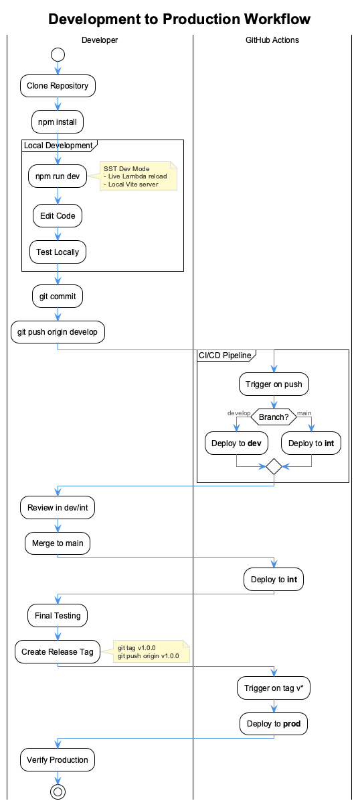
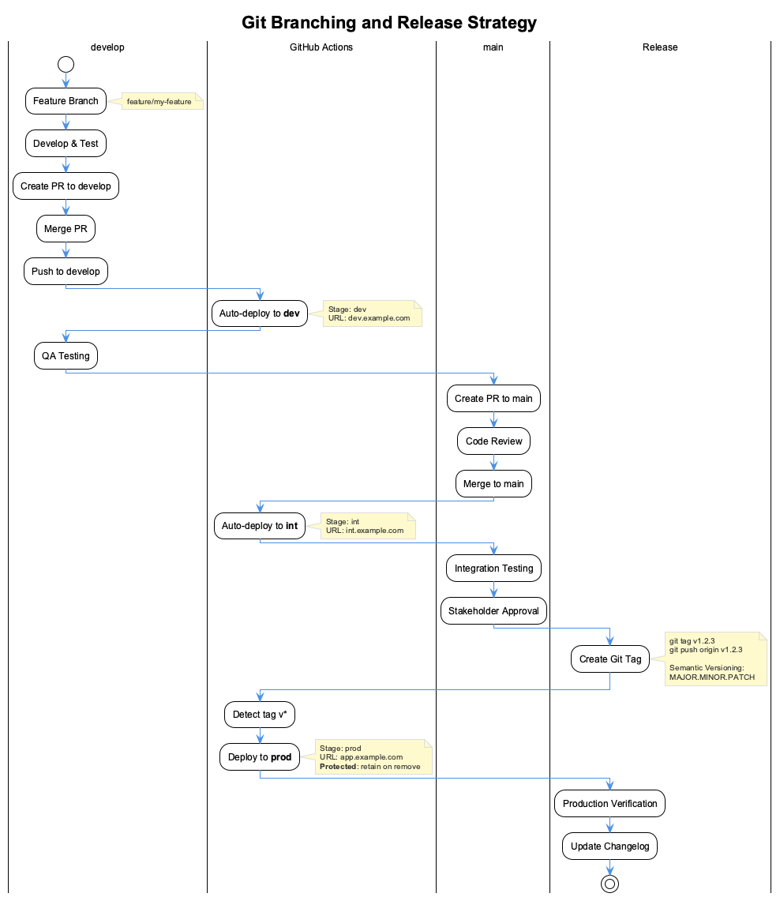

# Developer Tutorial

A step-by-step guide to setting up, developing, testing, and deploying your application from local development to production.

## Overview

This tutorial covers the complete development lifecycle:



| Phase | Environment | Trigger |
|-------|-------------|---------|
| Development | Local | `npm run dev` |
| Integration | dev | Push to `develop` branch |
| Staging | int | Push to `main` branch |
| Production | prod | Git tag `v*` |

### Tutorial Sections

1. [Part 1: Project Setup](#part-1-project-setup) - Clone, configure AWS, initial deployment
2. [Part 2: Local Development](#part-2-local-development) - Development workflow with Vite + SST
3. [Part 3: SST Console](#part-3-sst-console) - Monitoring and debugging dashboard
4. [Part 4: CI/CD Deployment](#part-4-cicd-deployment) - Branch strategy and automated deployments
5. [Part 5: Production Release](#part-5-production-release) - Release workflow and verification
6. [Part 6: Rollback](#part-6-rollback-if-needed) - Recovery procedures
7. [Part 7: SST Infrastructure as Code](#part-7-sst-infrastructure-as-code) - Understanding `sst.config.ts`

---

## Part 1: Project Setup

### 1.1 Clone and Install

```bash
git clone <repository-url>
cd ui-template
npm install
```

### 1.2 Configure AWS Credentials

You need AWS credentials before deploying. Choose one method:

**Personal AWS Account:**

```bash
aws configure
```

Enter your Access Key ID, Secret Access Key, and region (`eu-central-1`).

**Corporate SSO:**

```bash
# One-time setup
aws configure sso

# Login before each session
aws sso login --profile your-profile
export AWS_PROFILE=your-profile
```

### 1.3 Initial Deployment

Deploy your personal development stack:

```bash
npm run setup
```

This creates all AWS resources under your username (e.g., `ui-template-john`).

---

## Part 2: Local Development

### 2.1 Start Development Mode

```bash
npm run dev
```

This command:

- Starts Vite at `http://localhost:5173`
- Connects to your AWS resources
- Enables live Lambda reload (changes deploy instantly)

### 2.2 Development Workflow

1. **Edit frontend code** in `src/` - Vite hot-reloads automatically
2. **Edit Lambda code** in `lambda/` - SST deploys changes in ~1 second
3. **View in browser** at `http://localhost:5173`

### 2.3 Local-Only Mode (No AWS)

For frontend-only work without AWS:

```bash
npm run dev:local
```

---

## Part 3: SST Console

The SST Console (`console.sst.dev`) provides a web dashboard for monitoring your application during development.


### 3.1 Requirements

> **Important**: The SST Console CloudFormation stack must be deployed to **us-east-1**, regardless of where your application is deployed.

| Requirement | Details |
|-------------|---------|
| Region | `us-east-1` (mandatory) |
| Account | AWS account with your SST apps |
| Apps | SST v3 applications |

### 3.2 Setup SST Console

1. **Create Account**: Go to [console.sst.dev](https://console.sst.dev) and sign up with your work email

2. **Create Workspace**: Name your workspace (e.g., your company name)

3. **Connect AWS Account**: Click "Add AWS Account" and deploy the CloudFormation stack

   > **Critical**: When prompted for region, select **us-east-1**. If you accidentally choose another region, delete the stack and recreate it in us-east-1.

4. **Wait for Scan**: The Console scans all regions for SST apps (takes ~2 minutes)

### 3.3 Using the Console

Once connected, the Console provides:

| Feature | Description |
|---------|-------------|
| **Resources** | View all deployed resources (Lambda, S3, etc.) |
| **Logs** | Real-time logs when running `sst dev` |
| **Issues** | Alerts for errors and warnings |
| **Deploys** | History of all deployments |

**Real-time Logs During Development:**

When you run `npm run dev`, the Console automatically detects your local session and streams logs in real-time:

1. Open [console.sst.dev](https://console.sst.dev)
2. Select your app and stage
3. Click "Logs" tab
4. Start `npm run dev` locally
5. Logs appear instantly as requests come in

### 3.4 Browser Compatibility

| Browser | Status | Notes |
|---------|--------|-------|
| Chrome | Works | Recommended |
| Firefox | Works | - |
| Edge | Works | - |
| Safari | Requires setup | Run `npx sst cert` first |
| Brave | Requires setup | Run `npx sst cert` first |

For Safari/Brave, generate a local certificate:

```bash
npx sst cert
```

---

## Part 4: CI/CD Deployment

### 4.1 Branch Strategy



| Branch | Deploys To | Purpose |
|--------|------------|---------|
| `develop` | dev | Active development |
| `main` | int | Integration/staging |
| `v*` tags | prod | Production releases |

### 4.2 Deploy to Dev

Push your changes to the `develop` branch:

```bash
git checkout develop
git add .
git commit -m "feat: add new feature"
git push origin develop
```

GitHub Actions automatically:

1. Runs tests and linting
2. Deploys to `dev` stage
3. Reports success/failure

### 4.3 Deploy to Int (Staging)

Merge `develop` into `main`:

```bash
git checkout main
git merge develop
git push origin main
```

Or create a Pull Request on GitHub for code review.

### 4.4 Monitor Deployments

Check deployment status:

- **GitHub Actions**: Repository → Actions tab
- **SST Console**: console.sst.dev → Your App → Deploys

---

## Part 5: Production Release

### 5.1 Pre-Release Checklist

Before releasing to production:

- [ ] All tests pass on `int`
- [ ] Manual testing completed
- [ ] Stakeholder approval received
- [ ] Version number decided

### 5.2 Create a Release Tag

Use semantic versioning (`MAJOR.MINOR.PATCH`):

```bash
# Ensure you're on main with latest changes
git checkout main
git pull origin main

# Create and push the tag
git tag v1.0.0
git push origin v1.0.0
```

**Version Guidelines:**

| Change | Version | Example |
|--------|---------|---------|
| Bug fixes | PATCH | `v1.0.1` |
| New features | MINOR | `v1.1.0` |
| Breaking changes | MAJOR | `v2.0.0` |

### 5.3 GitHub Release (Optional)

Create a formal release on GitHub:

1. Go to Repository → Releases → "Create a new release"
2. Select your tag (e.g., `v1.0.0`)
3. Add release title and notes
4. Click "Publish release"

### 5.4 Verify Production

After the deployment completes:

1. **Check GitHub Actions** for successful deployment
2. **Visit production URL** from deployment output
3. **Test critical paths**: Login, main features
4. **Monitor SST Console** for any errors

---

## Part 6: Rollback (If Needed)

### 6.1 Quick Rollback

Deploy a previous version by checking out the tag:

```bash
git checkout v0.9.0
npm run deploy:prod
```

### 6.2 SST Rollback

SST keeps deployment history. View previous deployments:

```bash
# View deployment history in SST Console
# Or check .sst/log/sst.log
```

---

## Quick Reference

### Commands

| Command | Purpose |
|---------|---------|
| `npm run dev` | Local development with AWS |
| `npm run dev:local` | Local development (no AWS) |
| `npm run deploy` | Deploy personal stage |
| `npm run deploy:dev` | Deploy to dev |
| `npm run deploy:int` | Deploy to int |
| `npm run deploy:prod` | Deploy to prod |
| `npm run remove` | Remove deployment |

### Git Commands

| Command | Purpose |
|---------|---------|
| `git push origin develop` | Trigger dev deployment |
| `git push origin main` | Trigger int deployment |
| `git tag v1.0.0 && git push origin v1.0.0` | Trigger prod deployment |

### URLs

| Resource | URL |
|----------|-----|
| SST Console | [console.sst.dev](https://console.sst.dev) |
| SST Docs | [sst.dev/docs](https://sst.dev/docs/) |
| GitHub Actions | Your repo → Actions tab |

---

## Troubleshooting

### "SST Console not showing my app"

1. Verify CloudFormation stack is in **us-east-1**
2. Wait 2-3 minutes for initial scan
3. Check the app is deployed with SST v3

### "Logs not appearing in Console"

1. Ensure `npm run dev` is running
2. Use Chrome/Firefox (or run `npx sst cert` for Safari)
3. Check browser console for connection errors

### "Deployment failed"

```bash
# View detailed logs
npx sst deploy --stage dev 2>&1 | tee deploy.log

# Check for lock issues
npx sst unlock --stage dev

# Clean retry
npm run remove && npm run deploy
```

### "Production deployment blocked"

Production (`prod`) stage has protection enabled:

- Cannot be accidentally deleted
- Resources retained on removal
- Requires explicit `--stage prod` flag

---

## Part 7: SST Infrastructure as Code

SST v3 uses a single TypeScript configuration file (`sst.config.ts`) to define all AWS infrastructure. This "Infrastructure as Code" approach ensures your cloud resources are version-controlled, reviewable, and reproducible.

### 7.1 Configuration Overview

The `sst.config.ts` file is divided into two main sections:

```typescript
export default $config({
  app(input) {
    // Application-level settings (name, region, protection)
    return { ... };
  },
  async run() {
    // Resource definitions (Cognito, Lambda, S3, CloudFront)
  },
});
```

### 7.2 Application Settings

The `app()` function configures project-wide settings:

```typescript
app(input) {
  return {
    name: "ui-template",              // Stack name prefix
    removal: input?.stage === "prod"
      ? "retain" : "remove",          // Keep prod resources on delete
    protect: input?.stage === "prod", // Prevent accidental deletion
    home: "aws",                      // Cloud provider
    providers: {
      aws: { region: "eu-central-1" },
    },
  };
}
```

| Setting | Purpose |
|---------|---------|
| `name` | Prefix for all AWS resource names |
| `removal` | `retain` keeps resources, `remove` deletes them |
| `protect` | Enables deletion protection (prod only) |
| `home` | Cloud provider (`aws`, `cloudflare`) |
| `providers.aws.region` | Default AWS region |

### 7.3 Cognito User Pool

Authentication is handled by AWS Cognito:

```typescript
const userPool = new sst.aws.CognitoUserPool("Auth", {
  usernames: ["email"],
  transform: {
    userPool: {
      passwordPolicy: {
        minimumLength: 8,
        requireLowercase: true,
        requireUppercase: true,
        requireNumbers: true,
        requireSymbols: false,
      },
      autoVerifiedAttributes: ["email"],
    },
  },
});

const userPoolClient = userPool.addClient("WebClient", {
  transform: {
    client: {
      explicitAuthFlows: ["ALLOW_USER_SRP_AUTH", "ALLOW_REFRESH_TOKEN_AUTH"],
      accessTokenValidity: 1,   // 1 hour
      refreshTokenValidity: 30, // 30 days
    },
  },
});
```

| Configuration | Value | Purpose |
|---------------|-------|---------|
| `usernames` | `["email"]` | Users sign in with email |
| `passwordPolicy` | 8+ chars, mixed case, numbers | Security requirements |
| `accessTokenValidity` | 1 hour | Short-lived for security |
| `refreshTokenValidity` | 30 days | Long-lived for convenience |

### 7.4 Lambda API Function

The backend API runs on AWS Lambda with a Function URL:

```typescript
const api = new sst.aws.Function("Api", {
  handler: "lambda/api/index.handler",
  timeout: "30 seconds",
  memory: "256 MB",
  environment: {
    NODE_ENV: $app.stage,
    USER_POOL_ID: userPool.id,
    USER_POOL_CLIENT_ID: userPoolClient.id,
  },
  url: {
    cors: {
      allowOrigins: ["*"],
      allowMethods: ["*"],
      allowHeaders: ["*"],
    },
  },
});
```

| Setting | Value | Purpose |
|---------|-------|---------|
| `handler` | `lambda/api/index.handler` | Entry point for API |
| `timeout` | 30 seconds | Max execution time |
| `memory` | 256 MB | Allocated memory |
| `url.cors` | Permissive | CORS handled by SST |

> **Note**: CORS is configured in SST, not in Lambda code. Never add CORS headers in your Lambda handler—SST does this automatically.

### 7.5 Static Site (Frontend)

The React frontend deploys to S3 with CloudFront CDN:

```typescript
const web = new sst.aws.StaticSite("Web", {
  build: {
    command: "npm run build",
    output: "dist",
  },
  environment: {
    VITE_API_URL: api.url,
    VITE_COGNITO_USER_POOL_ID: userPool.id,
    VITE_COGNITO_USER_POOL_CLIENT_ID: userPoolClient.id,
    VITE_ENVIRONMENT: $app.stage,
  },
});
```

| Setting | Value | Purpose |
|---------|-------|---------|
| `build.command` | `npm run build` | Vite production build |
| `build.output` | `dist` | Build output directory |
| `environment` | `VITE_*` variables | Injected at build time |

Environment variables prefixed with `VITE_` are embedded into the frontend during the build process and accessible via `import.meta.env`.

### 7.6 Outputs

The `run()` function returns values that SST displays after deployment:

```typescript
return {
  apiUrl: api.url,
  webUrl: web.url,
  userPoolId: userPool.id,
  userPoolClientId: userPoolClient.id,
  stage: $app.stage,
};
```

After deployment, you'll see:

```text
✓  Complete
   Web: https://dz0qt8k015f75.cloudfront.net
   Api: https://xxx.lambda-url.eu-central-1.on.aws/
   ---
   apiUrl: https://xxx.lambda-url.eu-central-1.on.aws/
   stage: dev
   userPoolClientId: 18ho2tptqf8lm3mhnr89dtt2b9
   userPoolId: eu-central-1_xYfLflsEv
   webUrl: https://dz0qt8k015f75.cloudfront.net
```

### 7.7 Modifying Infrastructure

To add new AWS resources:

1. **Edit `sst.config.ts`** — Add resource definition
2. **Run `npm run deploy`** — SST detects changes
3. **Review changes** — SST shows what will be created/modified
4. **Confirm deployment** — Resources are provisioned

**Example: Adding a DynamoDB Table**

```typescript
const table = new sst.aws.Dynamo("Users", {
  fields: {
    userId: "string",
    email: "string",
  },
  primaryIndex: { hashKey: "userId" },
  globalIndexes: {
    emailIndex: { hashKey: "email" },
  },
});

// Link to Lambda
const api = new sst.aws.Function("Api", {
  link: [table],
  // ... other config
});
```

### 7.8 SST Resources Reference

| Resource | Class | Documentation |
|----------|-------|---------------|
| Lambda Function | `sst.aws.Function` | [sst.dev/docs/component/aws/function](https://sst.dev/docs/component/aws/function) |
| Static Site | `sst.aws.StaticSite` | [sst.dev/docs/component/aws/static-site](https://sst.dev/docs/component/aws/static-site) |
| Cognito | `sst.aws.CognitoUserPool` | [sst.dev/docs/component/aws/cognito-user-pool](https://sst.dev/docs/component/aws/cognito-user-pool) |
| DynamoDB | `sst.aws.Dynamo` | [sst.dev/docs/component/aws/dynamo](https://sst.dev/docs/component/aws/dynamo) |
| S3 Bucket | `sst.aws.Bucket` | [sst.dev/docs/component/aws/bucket](https://sst.dev/docs/component/aws/bucket) |
| API Gateway | `sst.aws.ApiGatewayV2` | [sst.dev/docs/component/aws/apigatewayv2](https://sst.dev/docs/component/aws/apigatewayv2) |

---

## Next Steps

1. **[Quick Start Guide](./quick-start-guide.md)** - Faster setup reference
2. **[Developer Guide](./developer-guide.md)** - Architecture and patterns
3. **[Deployment Guide](./deployment-guide.md)** - Detailed AWS deployment
