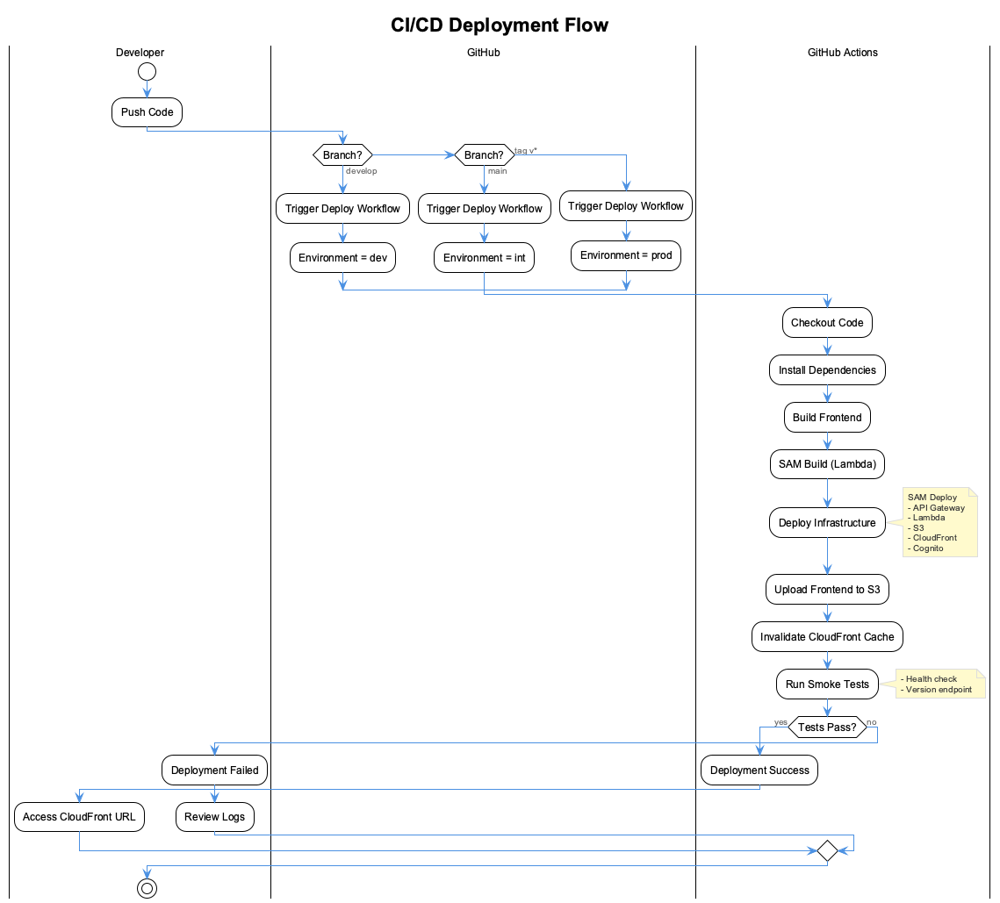

# AWS Deployment Guide

This guide walks you through deploying the UI Template application to AWS with multi-environment support (dev, int, prod).

## Architecture Overview


The application uses a serverless architecture with:

- **CloudFront** - CDN for static assets and API routing
- **S3** - Static website hosting for the React frontend
- **API Gateway** - REST API with Cognito authorization
- **Lambda** - Serverless API handler
- **Cognito** - User authentication and authorization

## Prerequisites

Before you begin, ensure you have the following installed:

### Required Tools

1. **AWS CLI** (v2.x)
   ```bash
   # macOS
   brew install awscli

   # Verify installation
   aws --version
   ```

2. **AWS SAM CLI** (v1.100+)
   ```bash
   # macOS
   brew install aws-sam-cli

   # Verify installation
   sam --version
   ```

3. **Node.js** (v20+)
   ```bash
   # Using nvm (recommended)
   nvm install 20
   nvm use 20

   # Verify installation
   node --version
   ```

4. **Git** (for CI/CD)
   ```bash
   git --version
   ```

### AWS Account Setup

1. **AWS Account**: You need an AWS account with appropriate permissions
2. **IAM User/Role**: Create an IAM user with the following permissions:
   - `AWSLambda_FullAccess`
   - `AmazonAPIGatewayAdministrator`
   - `AmazonS3FullAccess`
   - `CloudFrontFullAccess`
   - `AmazonCognitoPowerUser`
   - `IAMFullAccess` (for creating roles)
   - `CloudFormationFullAccess`

3. **Configure AWS CLI**:
   ```bash
   aws configure
   # Enter your AWS Access Key ID
   # Enter your AWS Secret Access Key
   # Default region: eu-central-1
   # Default output format: json
   ```

## Deployment Methods

### Method 1: Manual Deployment (Recommended for First Time)

#### Step 1: Install Dependencies

```bash
# Install frontend dependencies
npm install

# Install Lambda dependencies
cd lambda/api
npm install
cd ../..
```

#### Step 2: Build the Application

```bash
# Build SAM application (Lambda functions)
sam build
```

#### Step 3: Deploy to Development Environment

```bash
# Deploy to dev (auto-confirms changes)
sam deploy --config-env dev

# Or use the npm script
npm run sam:deploy:dev
```

**Expected output**:
```
CloudFormation outputs from deployed stack
------------------------------------------
Outputs
------------------------------------------
Key                 ApiUrl
Description         API Gateway endpoint URL
Value               https://xxxxxxxxxx.execute-api.eu-central-1.amazonaws.com/dev/

Key                 CloudFrontUrl
Description         CloudFront distribution URL
Value               https://dxxxxxxxxxx.cloudfront.net

Key                 UserPoolId
Description         Cognito User Pool ID
Value               eu-central-1_xxxxxxxxx

Key                 UserPoolClientId
Description         Cognito User Pool Client ID
Value               xxxxxxxxxxxxxxxxxxxxxxxxxx
```

#### Step 4: Build and Deploy Frontend

```bash
# Create .env with deployed values
cat > .env << EOF
VITE_COGNITO_USER_POOL_ID=<UserPoolId from output>
VITE_COGNITO_USER_POOL_CLIENT_ID=<UserPoolClientId from output>
VITE_COGNITO_REGION=eu-central-1
VITE_API_URL=<ApiUrl from output>
VITE_ENVIRONMENT=dev
EOF

# Build frontend with environment variables
npm run build

# Deploy to S3
aws s3 sync dist/ s3://<StaticWebsiteBucketName from output>/ --delete

# Invalidate CloudFront cache
aws cloudfront create-invalidation \
  --distribution-id <CloudFrontDistributionId> \
  --paths "/*"
```

#### Step 5: Verify Deployment

```bash
# Test API health endpoint
curl https://<CloudFrontUrl>/api/health

# Expected response:
# {"status":"healthy","timestamp":"...","environment":"dev"}
```

Open the CloudFront URL in your browser to access the application.

### Method 2: CI/CD Deployment (GitHub Actions)



#### Step 1: Configure GitHub Secrets

Go to your GitHub repository Settings > Secrets and variables > Actions, and add:

| Secret Name | Description |
|-------------|-------------|
| `AWS_ACCESS_KEY_ID` | Your AWS Access Key ID |
| `AWS_SECRET_ACCESS_KEY` | Your AWS Secret Access Key |

#### Step 2: Push to Deploy

The CI/CD pipeline automatically deploys based on branch/tag:

| Trigger | Target Environment |
|---------|-------------------|
| Push to `develop` | **dev** |
| Push to `main` | **int** (integration/staging) |
| Tag `v*` (e.g., `v1.0.0`) | **prod** |

```bash
# Deploy to dev
git checkout develop
git push origin develop

# Deploy to int (staging)
git checkout main
git merge develop
git push origin main

# Deploy to prod
git tag v1.0.0
git push origin v1.0.0
```

#### Step 3: Monitor Deployment

1. Go to GitHub repository > Actions
2. Click on the running workflow
3. Monitor each job's progress:
   - `determine-environment`
   - `build`
   - `deploy-infrastructure`
   - `deploy-frontend`
   - `smoke-tests`

## Version Management

The application includes automatic version tracking that displays in the status bar alongside the environment indicator.

### How Version Works

The version number is sourced from `package.json` and injected at build time via Vite's `define` configuration:

```typescript
// vite.config.ts
define: {
  __APP_VERSION__: JSON.stringify(process.env.npm_package_version || '0.0.0'),
  __APP_BUILD_TIME__: JSON.stringify(new Date().toISOString()),
}
```

The status bar displays:
- **Environment badge** (LOCAL/DEV/INT/PROD) - color-coded by environment
- **Clock** - current time
- **Version** - from package.json (e.g., v1.0.0)

### Automatic Version Bumping

When deploying via the SAM deploy scripts, the version is automatically incremented:

```bash
# These commands auto-bump patch version before deploying
npm run sam:deploy:dev   # Bumps 1.0.0 → 1.0.1, then deploys
npm run sam:deploy:int   # Bumps 1.0.1 → 1.0.2, then deploys
npm run sam:deploy:prod  # Bumps 1.0.2 → 1.0.3, then deploys
```

### Manual Version Control

For manual version management:

```bash
# Bump patch version (1.0.0 → 1.0.1)
npm run version:patch

# Bump minor version (1.0.0 → 1.1.0)
npm run version:minor

# Bump major version (1.0.0 → 2.0.0)
npm run version:major

# Then build and deploy manually
npm run build
```

### CI/CD Version Handling

The GitHub Actions workflow handles versioning automatically:

1. **Build Phase**: Reads version from `package.json`
2. **Environment Injection**: Sets `VITE_ENVIRONMENT` based on deployment target
3. **Frontend Build**: Injects version and environment into the bundle

```yaml
# From .github/workflows/deploy.yml
cat > .env << EOF
VITE_ENVIRONMENT=$ENV
EOF
npm run build
```

### Environment Detection

The environment is determined by:

| Source | Variable | Example |
|--------|----------|---------|
| `.env` file | `VITE_ENVIRONMENT` | `local` |
| CI/CD pipeline | Set automatically | `dev`, `int`, `prod` |
| Build scripts | `npm run build:dev` | `dev` |

### Status Bar Display

The BottomBar component displays version and environment:

| Environment | Badge Color | Example Display |
|-------------|-------------|-----------------|
| local | Gray | `[LOCAL] 10:30 AM v1.0.0` |
| dev | Blue | `[DEV] 10:30 AM v1.0.1` |
| int | Amber | `[INT] 10:30 AM v1.0.2` |
| prod | Red | `[PROD] 10:30 AM v1.0.3` |

## Environment-Specific Configuration

### Development (dev)

```toml
# samconfig.toml [dev] section
parameter_overrides = [
  "Environment=dev",
  "LogLevel=debug",
  "CorsOrigin=*"
]
```

- **Purpose**: Active development and testing
- **Logging**: Debug level (verbose)
- **CORS**: Open (allows all origins)
- **Auto-deploy**: On push to `develop`

### Integration (int)

```toml
# samconfig.toml [int] section
parameter_overrides = [
  "Environment=int",
  "LogLevel=info",
  "CorsOrigin=*"
]
```

- **Purpose**: Staging/QA environment
- **Logging**: Info level
- **CORS**: Open (or restrict to staging domain)
- **Auto-deploy**: On push to `main`

### Production (prod)

```toml
# samconfig.toml [prod] section
parameter_overrides = [
  "Environment=prod",
  "LogLevel=warn",
  "CorsOrigin=*"
]
```

- **Purpose**: Live production environment
- **Logging**: Warn level (minimal)
- **CORS**: Should be restricted to production domain
- **Auto-deploy**: On release tag (`v*`)

## Post-Deployment Tasks

### 1. Create Initial Admin User

```bash
# Using AWS CLI
aws cognito-idp admin-create-user \
  --user-pool-id <UserPoolId> \
  --username admin@example.com \
  --user-attributes Name=email,Value=admin@example.com \
  --temporary-password "TempPass123!" \
  --message-action SUPPRESS

# Set permanent password
aws cognito-idp admin-set-user-password \
  --user-pool-id <UserPoolId> \
  --username admin@example.com \
  --password "YourSecurePassword123!" \
  --permanent
```

### 2. Configure Custom Domain (Optional)

To use a custom domain instead of CloudFront's default URL:

1. **Request/Import SSL Certificate** in AWS Certificate Manager (ACM)
   - Must be in `us-east-1` region for CloudFront

2. **Update CloudFront Distribution**:
   ```yaml
   # Add to template.yaml CloudFrontDistribution
   Aliases:
     - your-domain.com
   ViewerCertificate:
     AcmCertificateArn: !Ref CertificateArn
     SslSupportMethod: sni-only
   ```

3. **Configure DNS** (Route 53 or external):
   - Create CNAME or Alias record pointing to CloudFront distribution

### 3. Set Up Monitoring and Alerts

```bash
# Create CloudWatch alarm for API errors
aws cloudwatch put-metric-alarm \
  --alarm-name "ui-template-dev-api-errors" \
  --metric-name "5XXError" \
  --namespace "AWS/ApiGateway" \
  --statistic Sum \
  --period 300 \
  --threshold 10 \
  --comparison-operator GreaterThanThreshold \
  --evaluation-periods 1 \
  --dimensions Name=ApiName,Value=ui-template-api-dev
```

## Local Development

### Running Locally (Without AWS)

```bash
# Start frontend dev server + local API server
npm run start

# Or separately:
npm run dev      # Frontend only (http://localhost:5173)
npm run server   # Local API server (http://localhost:3030)
```

### Running Lambda Locally (With SAM)

```bash
# Start SAM local API
npm run sam:local

# This starts Lambda on http://localhost:3001
# Configure frontend to use this endpoint in .env
```

## Troubleshooting

### Common Issues

#### 1. SAM Build Fails

```bash
# Error: Unable to build NodeJS project
# Solution: Ensure Node.js version matches Lambda runtime
node --version  # Should be v20.x

# Clean and rebuild
rm -rf .aws-sam
sam build
```

#### 2. CloudFormation Stack Stuck

```bash
# Check stack events
aws cloudformation describe-stack-events \
  --stack-name ui-template-dev \
  --query 'StackEvents[?ResourceStatus==`CREATE_FAILED`]'

# Delete and redeploy if needed
aws cloudformation delete-stack --stack-name ui-template-dev
sam deploy --config-env dev
```

#### 3. CORS Errors in Browser

Check that:
1. API Gateway CORS is configured correctly
2. Lambda returns proper CORS headers
3. CloudFront forwards the `Origin` header

```bash
# Test CORS
curl -I -X OPTIONS https://<api-url>/api/health \
  -H "Origin: http://localhost:5173" \
  -H "Access-Control-Request-Method: GET"
```

#### 4. Authentication Fails

```bash
# Verify Cognito configuration
aws cognito-idp describe-user-pool \
  --user-pool-id <UserPoolId>

# Check client settings
aws cognito-idp describe-user-pool-client \
  --user-pool-id <UserPoolId> \
  --client-id <UserPoolClientId>
```

### Viewing Logs

```bash
# Lambda logs
aws logs tail /aws/lambda/ui-template-dev-api --follow

# API Gateway logs
aws logs tail /aws/apigateway/ui-template-dev --follow
```

## Cleanup

To remove all deployed resources:

```bash
# Delete the CloudFormation stack
aws cloudformation delete-stack --stack-name ui-template-dev

# Wait for deletion to complete
aws cloudformation wait stack-delete-complete --stack-name ui-template-dev

# Repeat for other environments
aws cloudformation delete-stack --stack-name ui-template-int
aws cloudformation delete-stack --stack-name ui-template-prod
```

**Note**: S3 buckets with content must be emptied before stack deletion:

```bash
aws s3 rm s3://<bucket-name> --recursive
```

## Quick Reference

### Useful Commands

| Command | Description |
|---------|-------------|
| `npm run dev` | Start local dev server |
| `npm run build` | Build frontend |
| `npm run build:dev` | Build with VITE_ENVIRONMENT=dev |
| `npm run build:int` | Build with VITE_ENVIRONMENT=int |
| `npm run build:prod` | Build with VITE_ENVIRONMENT=prod |
| `npm run version:patch` | Bump patch version (x.x.0 → x.x.1) |
| `npm run version:minor` | Bump minor version (x.0.x → x.1.0) |
| `npm run version:major` | Bump major version (0.x.x → 1.0.0) |
| `npm run sam:build` | Build Lambda functions |
| `npm run sam:local` | Run Lambda locally |
| `npm run sam:deploy:dev` | Auto-bump version + deploy to dev |
| `npm run sam:deploy:int` | Auto-bump version + deploy to int |
| `npm run sam:deploy:prod` | Auto-bump version + deploy to prod |

### Stack Outputs

After deployment, retrieve outputs:

```bash
aws cloudformation describe-stacks \
  --stack-name ui-template-dev \
  --query 'Stacks[0].Outputs' \
  --output table
```

### Environment URLs

| Environment | URL Pattern |
|-------------|-------------|
| dev | `https://dXXXXXXXXXX.cloudfront.net` |
| int | `https://dXXXXXXXXXX.cloudfront.net` |
| prod | `https://dXXXXXXXXXX.cloudfront.net` |

## Next Steps

1. **Customize Authentication**: Add social login providers (Google, GitHub)
2. **Add API Routes**: Extend Lambda handler with your business logic
3. **Set Up Monitoring**: Configure CloudWatch dashboards and alarms
4. **Configure WAF**: Add Web Application Firewall for security
5. **Enable Backups**: Set up S3 versioning and DynamoDB backups
