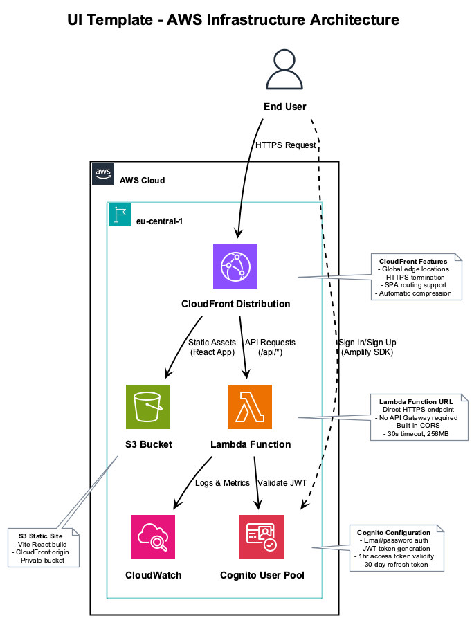
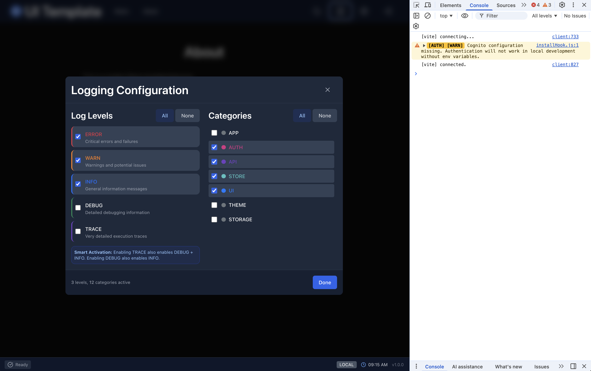

# Quick Start Guide

Get your UI Template application deployed to AWS in under 10 minutes.


## Prerequisites

Before you begin, ensure you have:

| Requirement | Version | Check Command |
|-------------|---------|---------------|
| Node.js | 18+ | `node -v` |
| npm | 9+ | `npm -v` |
| AWS CLI | 2.x | `aws --version` |
| AWS Account | - | [Create one](https://aws.amazon.com/free/) |

## Quick Deploy (3 Steps)

### Step 1: Clone and Install

```bash
git clone <repository-url>
cd ui-template
npm install
```

### Step 2: Configure AWS

Choose your authentication method:

#### Option A: Personal AWS Account (IAM User)

```bash
aws configure
# Enter your Access Key ID, Secret Key, and region (eu-central-1)
```

#### Option B: Corporate SSO

```bash
# First, configure your SSO profile (one-time setup)
aws configure sso

# Then login
aws sso login --profile your-profile-name
export AWS_PROFILE=your-profile-name
```

### Step 3: Deploy

```bash
npm run setup
```

The setup script will:
1. Verify your AWS credentials
2. Install dependencies
3. Let you choose a deployment stage
4. Deploy all infrastructure automatically

**That's it!** Your application is now live.

---

## What Gets Deployed



The deployment creates:

| Resource | Purpose |
|----------|---------|
| **Cognito User Pool** | User authentication (sign up, sign in, password reset) |
| **Lambda Function** | API backend with protected routes |
| **S3 Bucket** | Static website hosting |
| **CloudFront** | Global CDN for fast delivery |

---

## Development Workflow

### Local Development with Live Reload

```bash
npm run dev
```

This starts:
- Vite dev server at `http://localhost:5173`
- SST development mode connecting to real AWS resources
- Hot module replacement for instant feedback


### Local-Only Development (No AWS)

```bash
npm run dev:local
npm run server  # In another terminal for local API
```

---

## Deployment Commands

| Command | Description |
|---------|-------------|
| `npm run deploy` | Deploy to your personal stage |
| `npm run deploy:dev` | Deploy to `dev` stage |
| `npm run deploy:int` | Deploy to `int` stage |
| `npm run deploy:prod` | Deploy to `prod` stage |
| `npm run remove` | Remove your deployment |

### Viewing Outputs

After deployment, SST displays your URLs:

```
✓ Complete

   webUrl: https://d1234567890.cloudfront.net
   apiUrl: https://abc123.lambda-url.eu-central-1.on.aws
   userPoolId: eu-central-1_XXXXXXXX
   userPoolClientId: 1234567890abcdef
```

---

## Application Features

### Authentication


- Email-based sign up and sign in
- Password requirements enforced
- Email verification
- Forgot password flow

### Theming


- Light, Dark, and System themes
- Persisted across sessions
- Respects OS preferences

### Logging



- Configurable log levels (ERROR, WARN, INFO, DEBUG, TRACE)
- Category filtering (AUTH, API, STORE, UI, THEME, STORAGE)
- Settings persist in localStorage

---

## Environment Configuration

### For Local Development

Create a `.env` file (optional for local-only development):

```bash
VITE_API_URL=http://localhost:3030
VITE_ENVIRONMENT=local
```

### Environment Variables (Auto-configured by SST)

When deployed, SST automatically configures:

| Variable | Source |
|----------|--------|
| `VITE_API_URL` | Lambda function URL |
| `VITE_COGNITO_USER_POOL_ID` | Cognito User Pool |
| `VITE_COGNITO_USER_POOL_CLIENT_ID` | Cognito Client |
| `VITE_COGNITO_REGION` | AWS region |
| `VITE_ENVIRONMENT` | Stage name |

---

## Troubleshooting

### "AWS credentials not found"

```bash
# Check your current credentials
aws sts get-caller-identity

# For SSO users
aws sso login --profile your-profile
export AWS_PROFILE=your-profile
```

### "Permission denied" errors

Ensure your AWS user/role has permissions for:
- Lambda
- S3
- CloudFront
- Cognito
- CloudWatch Logs
- IAM (for creating roles)

### "Deployment failed"

```bash
# View detailed logs
npx sst deploy --stage dev 2>&1 | tee deploy.log

# Clean up and retry
npm run remove
npm run deploy
```

### SST lock issues

```bash
# If a previous deployment was interrupted
npx sst unlock --stage your-stage
```

---

## Project Structure

```
ui-template/
├── src/                    # React frontend
│   ├── components/         # UI components
│   ├── services/           # API client, auth
│   ├── store/              # Redux state
│   └── utils/              # Utilities (Logger)
├── lambda/                 # Lambda functions
│   └── api/                # API handler
├── scripts/
│   └── setup.sh            # Setup & deploy script
├── sst.config.ts           # SST infrastructure config
└── docs/                   # Documentation
```

---

## Next Steps

1. **Customize the UI** - Modify components in `src/components/`
2. **Add API routes** - Extend `lambda/api/index.ts`
3. **Add pages** - Create new pages in `src/pages/`
4. **Configure CI/CD** - See `.github/workflows/` for GitHub Actions

---

## Useful Resources

- [SST Documentation](https://sst.dev/docs/)
- [AWS Amplify Auth Docs](https://docs.amplify.aws/lib/auth/getting-started/)
- [Vite Documentation](https://vitejs.dev/)
- [React Documentation](https://react.dev/)

---

## Support

Having issues? Check:
1. [Developer Guide](./developer-guide.md) - Detailed technical documentation
2. [Deployment Guide](./deployment-guide.md) - AWS deployment details
3. [SST Discord](https://sst.dev/discord) - Community support
